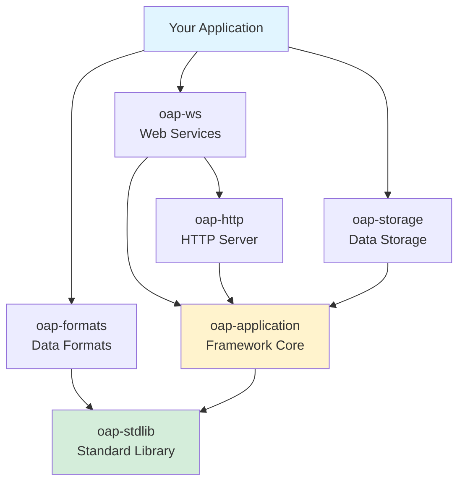

#  Open Application Platform

A lightweight application framework inspired by [Erlang/OTP](https://github.com/erlang/otp) for building high-performance, modular Java applications.

## Overview

The Open Application Platform (OAP) provides a comprehensive framework for developing production-ready Java applications with minimal boilerplate. It combines dependency injection, lifecycle management, configuration, web services, storage, and more into a cohesive ecosystem.

**Key Features:**
- ⚡ **Fast startup time** - Optimized for rapid development and deployment
- 🪶 **Small memory footprint** - Lean runtime with minimal overhead
- 🔄 **Lifecycle management** - Automatic supervision inspired by Erlang/OTP
- 🔌 **Modular architecture** - Loosely coupled modules with clear dependencies
- ⚙️ **Configuration-driven** - HOCON-based configuration system
- 🌐 **Built-in HTTP server** - High-performance non-blocking I/O with virtual threads
- 🗄️ **Storage abstraction** - Unified API for memory, MongoDB, and cloud storage
- 📡 **Web services** - Annotation-driven REST APIs with automatic serialization

## Quick Start

### Prerequisites

- Java 17 or later
- Maven 3.6 or later

### Create Your First Application

**1. Add dependencies to `pom.xml`:**

```xml
<properties>
    <oap.version>24.3.2</oap.version>
</properties>

<repositories>
    <repository>
        <id>oap</id>
        <url>https://artifacts.oaplatform.org/repository/oap-maven/</url>
    </repository>
</repositories>

<dependencies>
    <dependency>
        <groupId>oap</groupId>
        <artifactId>oap-application</artifactId>
        <version>${oap.version}</version>
    </dependency>
    <dependency>
        <groupId>oap</groupId>
        <artifactId>oap-ws</artifactId>
        <version>${oap.version}</version>
    </dependency>
</dependencies>
```

**2. Create a web service:**

```java
import oap.ws.WsMethod;
import oap.ws.WsParam;
import static oap.ws.WsParam.From.*;

public class HelloService {
    @WsMethod(path = "/hello", method = "GET")
    public String hello(@WsParam(from = QUERY) String name) {
        return "Hello, " + name + "!";
    }
}
```

**3. Configure module (`src/main/resources/META-INF/oap-module.conf`):**

```hocon
name = hello-app

services {
    hello-service {
        implementation = com.example.HelloService
    }

    hello-ws {
        implementation = oap.ws.WebServices
        parameters {
            services = [<modules.this.hello-service>]
        }
    }
}
```

**4. Configure application (`application.conf`):**

```hocon
boot.main = [oap-http, oap-ws, hello-app]
```

👉 **[Complete Getting Started Guide](docs/getting-started.md)** - Step-by-step tutorial

## Main Principles

### 1. Fast Start-up Time
- Minimal initialization overhead
- Lazy loading where possible
- Optimized class loading

### 2. Small Memory Footprint
- No heavy frameworks or application servers
- Efficient data structures (FastUtil collections)
- Optional features loaded on demand

### 3. Java Object Lifecycle Support
- Automatic start/stop management
- Graceful shutdown handling
- Resource cleanup guarantees

### 4. Loose Coupling
- Configuration-based wiring
- Clear module boundaries
- Minimal inter-module dependencies

### 5. Native RPC Support
- Binary protocol with checksums
- Service discovery and routing
- Transparent remote invocation

### 6. Modular Architecture
- Self-contained modules
- Explicit dependencies
- Composable functionality

## Documentation

### Getting Started
- **[Getting Started Guide](docs/getting-started.md)** - Build your first application
- **[Developer Guide](docs/developer-guide.md)** - Architecture, patterns, and best practices

### Core Modules
- **[oap-application](oap-application/README.md)** - Application framework, Kernel, Module system
- **[oap-stdlib](oap-stdlib/README.md)** - Standard library (I/O, JSON, concurrency, utilities)
- **[oap-http](oap-http/README.md)** - HTTP server, handlers, Prometheus metrics
- **[oap-ws](oap-ws/README.md)** - Web services framework with REST API support
- **[oap-storage](oap-storage/README.md)** - Storage abstraction (memory, MongoDB, S3)

### Data Formats
- **[oap-formats](oap-formats/README.md)** - Overview of all format modules
  - **[oap-json](oap-formats/oap-json/README.md)** - JSON schema validation and utilities
  - **[oap-template](oap-formats/oap-template/README.md)** - Template engine
  - **[oap-tsv](oap-formats/oap-tsv/README.md)** - TSV file handling
  - **[oap-logstream](oap-formats/oap-logstream/README.md)** - Structured logging and streaming

### Additional Modules
- **[oap-jpath](oap-jpath/README.md)** - JSON path expressions
- **[oap-mail](oap-mail/README.md)** - Email with queuing and multiple transports
- **[oap-message](oap-message/README.md)** - Binary messaging protocol
- **[oap-statsdb](oap-statsdb/README.md)** - In-memory statistics database
- **[oap-highload](oap-highload/README.md)** - High-performance utilities (CPU affinity)
- **[oap-alert-slack](oap-alert-slack/README.md)** - Slack alerting integration
- **[oap-maven-plugin](oap-maven-plugin/README.md)** - Maven build tools
- **[oap-stdlib-test](oap-stdlib-test/README.md)** - Testing utilities and fixtures

## Module Reference

| Module | Description | Key Features |
|--------|-------------|--------------|
| **Core Framework** |||
| [oap-application](oap-application/README.md) | Application container and module system | Kernel, DI, lifecycle, supervision |
| [oap-stdlib](oap-stdlib/README.md) | Standard library and utilities | I/O, JSON, concurrency, collections |
| **Web & HTTP** |||
| [oap-http](oap-http/README.md) | HTTP server with NIO | Virtual threads, compression, metrics |
| [oap-ws](oap-ws/README.md) | Web services framework | REST APIs, routing, validation |
| **Data & Storage** |||
| [oap-storage](oap-storage/README.md) | Storage abstraction layer | Memory, MongoDB, S3, change listeners |
| [oap-formats](oap-formats/README.md) | Data format utilities | JSON, TSV, templates, log streaming |
| **Integration** |||
| [oap-mail](oap-mail/README.md) | Email functionality | Queue, SMTP, SendGrid, retries |
| [oap-message](oap-message/README.md) | Binary messaging | MD5 checksums, routing, serialization |
| [oap-alert-slack](oap-alert-slack/README.md) | Slack notifications | Webhooks, rich formatting |
| **Utilities** |||
| [oap-jpath](oap-jpath/README.md) | JSON path expressions | Query, transform JSON data |
| [oap-statsdb](oap-statsdb/README.md) | Statistics database | Aggregation, master-node architecture |
| [oap-highload](oap-highload/README.md) | Performance utilities | CPU affinity, thread pinning |
| **Development** |||
| [oap-maven-plugin](oap-maven-plugin/README.md) | Build tools | Application packaging, code gen |
| [oap-stdlib-test](oap-stdlib-test/README.md) | Testing framework | Fixtures, mocks, assertions |

## Architecture Diagram



## Core Concepts

### Modular Architecture

Applications are composed of **modules**, each containing related **services**:

```
┌─────────────────────────────────┐
│         Your Application        │
│  ┌─────────┐    ┌─────────┐   │
│  │ Service │───▶│ Service │   │
│  └─────────┘    └─────────┘   │
└────────────┬────────────────────┘
             │ depends on
┌────────────▼────────────────────┐
│         OAP Modules             │
│  (oap-ws, oap-storage, etc.)    │
└────────────┬────────────────────┘
             │ depends on
┌────────────▼────────────────────┐
│      OAP Core Framework         │
│    (oap-application, stdlib)    │
└─────────────────────────────────┘
```

### Dependency Injection

Services are wired together through configuration:

```hocon
services {
    repository {
        implementation = com.example.UserRepository
        parameters {
            database = <modules.storage.main-db>
        }
    }

    user-service {
        implementation = com.example.UserService
        parameters {
            repository = <modules.this.repository>
        }
    }
}
```

### Lifecycle Management

Services have automatic lifecycle management:

```java
public class MyService {
    public void preStart() { /* Initialize resources */ }
    public void start() { /* Start operations */ }
    public void preStop() { /* Prepare for shutdown */ }
    public void stop() { /* Clean up resources */ }
}
```

## Examples

### REST API with Storage

```java
@Data
public class User {
    @Id public String id;
    public String email;
    public String name;
}

public class UserService {
    private final MemoryStorage<User> storage;

    public UserService(MemoryStorage<User> storage) {
        this.storage = storage;
    }

    @WsMethod(path = "/users", method = "GET")
    public List<User> listUsers() {
        return storage.list();
    }

    @WsMethod(path = "/users", method = "POST")
    public User createUser(@WsParam(from = BODY) User user) {
        if (user.id == null) user.id = UUID.randomUUID().toString();
        storage.store(user);
        return user;
    }

    @WsMethod(path = "/users/{id}", method = "GET")
    public Optional<User> getUser(@WsParam(from = PATH) String id) {
        return storage.get(id);
    }
}
```

### Background Task with Scheduling

```java
public class DataSyncTask implements Runnable {
    private final ExternalAPI api;
    private final Storage<Data> storage;

    @Override
    public void run() {
        List<Data> updates = api.fetchUpdates();
        updates.forEach(storage::store);
    }
}
```

Configuration:

```hocon
sync-task {
    implementation = com.example.DataSyncTask
    parameters {
        api = <modules.this.external-api>
        storage = <modules.this.data-storage>
    }
    supervision {
        supervise = true
        schedule = true
        cron = "0 */5 * * * ?"  # Every 5 minutes
    }
}
```

## Performance

OAP is designed for high-performance applications:

- **Virtual Threads** - Java 21+ virtual threads for high concurrency
- **Non-blocking I/O** - Undertow-based HTTP server
- **Zero-copy Streaming** - Efficient data transfer
- **Compression** - Built-in GZIP, LZ4, Zstd support
- **Object Pooling** - Reuse expensive objects
- **Lock-free Structures** - Concurrent data structures where possible

## Testing

OAP provides comprehensive testing support:

```java
import oap.application.testng.KernelFixture;
import org.testng.annotations.Test;

public class UserServiceTest extends KernelFixture {
    @Test
    public void testCreateUser() {
        UserService service = kernel.service("app", "user-service").get();
        User user = service.createUser(new User("alice@example.com", "Alice"));
        assertNotNull(user.id);
    }
}
```

## Version History

**Current Version**: 24.3.2

**Recent Changes:**
- CE-89: oap-remote - CompletableFuture support
- CE-88: undertow - Virtual threads for worker pool
- CE-86: oap-template - URL encoding fixes
- CE-84: oap-logstream - Migration to OkHttp + virtual threads

**Compatibility:**
- Java 17+ required
- Java 21+ recommended (for virtual threads)

## OAP Module Dependencies

```
oap-application → oap-stdlib
                ↓
oap-http → oap-stdlib
        ↓
oap-ws → oap-http
      ↓
oap-storage → oap-stdlib
           ↓
oap-statsdb
```

## Community & Support

- **Issues**: [GitHub Issues](https://github.com/oaplatform/oap/issues)
- **Wiki**: [GitHub Wiki](https://github.com/oaplatform/oap/wiki)
- **License**: MIT License

## See Also

- 📚 [Getting Started Guide](docs/getting-started.md)
- 🔧 [Developer Guide](docs/developer-guide.md)
- 📖 [Module Documentation](#module-reference)

---

**Built with ❤️ by the OAP Platform Authors**
