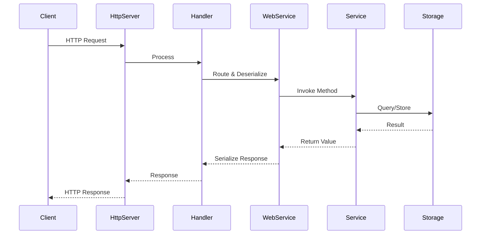

# OAP Developer Guide

This guide covers the core concepts, architectural patterns, and best practices for developing applications with the Open Application Platform.

## Table of Contents

1. [Core Architecture](#core-architecture)
2. [Module System](#module-system)
3. [Dependency Injection](#dependency-injection)
4. [Lifecycle Management](#lifecycle-management)
5. [Configuration System](#configuration-system)
6. [Web Services](#web-services)
7. [Storage Layer](#storage-layer)
8. [Error Handling](#error-handling)
9. [Testing](#testing)
10. [Performance](#performance)
11. [Best Practices](#best-practices)

## Core Architecture

### Philosophy

OAP is inspired by Erlang/OTP and follows these principles:

1. **Modular Design** - Applications are composed of loosely coupled modules
2. **Configuration over Code** - Behavior configured declaratively in HOCON files
3. **Supervision** - Automatic lifecycle management with supervision trees
4. **Fast Startup** - Minimal overhead for rapid development and deployment
5. **Small Footprint** - Lean runtime with only necessary dependencies

### Application Layers

```
┌─────────────────────────────────────────┐
│        Application Services             │  Your business logic
├─────────────────────────────────────────┤
│           OAP Modules                   │  oap-ws, oap-storage, etc.
├─────────────────────────────────────────┤
│         Core Framework                  │  oap-application (Kernel)
├─────────────────────────────────────────┤
│          Standard Library               │  oap-stdlib (utilities)
└─────────────────────────────────────────┘
```

### Request Flow



## Module System

### Module Anatomy

A module is defined by `META-INF/oap-module.conf` and consists of:

```hocon
name = my-module                    # Unique identifier

dependsOn = [other-module]          # Module dependencies

activation {
  activeByDefault = false           # Load without explicit boot.main entry
}

services {
  service-name {
    implementation = com.example.ServiceClass
    parameters { }
    supervision { }
    dependsOn = []
    listen { }
    link { }
  }
}
```

### Module Dependencies

Modules form a directed acyclic graph (DAG):

```
oap-stdlib
    ↓
oap-http
    ↓
oap-ws  →  oap-storage
    ↓           ↓
  your-application
```

**Loading order:**
1. Dependencies loaded before dependents
2. Topological sort ensures correct initialization
3. Circular dependencies are detected and rejected

### Module Discovery

Modules are discovered from:
1. Classpath: `META-INF/*/oap-module.conf`
2. Explicit URLs passed to `Kernel` constructor
3. JAR files in classpath

```java
// Automatic discovery
Kernel kernel = new Kernel(List.of());

// Explicit modules
List<URL> modules = List.of(
    getClass().getResource("/META-INF/oap-module.conf"),
    getClass().getResource("/META-INF/oap-ws/oap-module.conf")
);
Kernel kernel = new Kernel(modules);
```

## Dependency Injection

### Service References

Services reference each other using **service references**:

```hocon
parameters {
  # Reference format: <modules.[module-name].[service-name]>

  sameModule = <modules.this.other-service>        # Same module
  otherModule = <modules.other-module.service>     # Different module
  anyModule = <modules.*.service-name>             # First match across all modules
}
```

### Injection Points

Dependencies can be injected via:

**1. Constructor Parameters**
```java
public class UserService {
    private final UserRepository repository;
    private final EmailService emailService;

    // Constructor injection (preferred)
    public UserService(UserRepository repository, EmailService emailService) {
        this.repository = repository;
        this.emailService = emailService;
    }
}
```

Configuration:
```hocon
user-service {
    implementation = com.example.UserService
    parameters {
        repository = <modules.this.user-repository>
        emailService = <modules.messaging.email-service>
    }
}
```

**2. Public Fields**
```java
public class ReportService {
    public Database database;  // Will be injected
    public TemplateEngine templateEngine;
}
```

Configuration:
```hocon
report-service {
    implementation = com.example.ReportService
    parameters {
        database = <modules.storage.main-db>
        templateEngine = <modules.templates.engine>
    }
}
```

**3. Collections**
```java
public class PluginManager {
    public final List<Plugin> plugins = new ArrayList<>();
}
```

Configuration:
```hocon
plugin-manager {
    implementation = com.example.PluginManager
    parameters {
        plugins = [
            <modules.this.plugin1>
            <modules.this.plugin2>
            <modules.other.plugin3>
        ]
    }
}
```

### Type Coercion

OAP automatically converts between compatible types:

```hocon
parameters {
    timeout = 30s           # String "30s" → Duration
    port = 8080            # Number → int/Integer
    enabled = true         # Boolean
    tags = [a, b, c]       # List
    config = {             # Map
        key = value
    }
}
```

**Supported conversions:**
- Strings to primitives (int, long, boolean, etc.)
- Durations: `30s`, `5m`, `1h`, `2d`
- Sizes: `1KB`, `10MB`, `1GB`
- Enums: String names to enum constants
- Collections: Lists, Sets, Maps
- Custom coercions via `Coercions`

## Lifecycle Management

### Service Lifecycle

Services follow this lifecycle:

```
[Created] → [Initialized] → [Started] → [Running] → [Stopped]
              ↓               ↓                       ↓
         preStart()       start()                 stop()
                                                preStop()
```

### Supervision Configuration

```hocon
supervision {
    supervise = true               # Enable lifecycle management
    preStartWith = "preStart"      # Method name for pre-start
    startWith = "start"            # Method name for start
    preStopWith = "preStop"        # Method name for pre-stop
    stopWith = "stop"              # Method name for stop

    thread = false                 # Run service in dedicated thread
    schedule = false               # Run service on schedule
    delay = 0                      # Fixed delay (milliseconds)
    cron = null                    # Cron expression
}
```

### Lifecycle Methods

```java
public class MyService {
    private ExecutorService executor;

    // Called before service starts
    public void preStart() {
        // Initialize resources
        executor = Executors.newFixedThreadPool(10);
    }

    // Called to start service
    public void start() {
        // Begin operations
        log.info("Service started");
    }

    // Called before service stops
    public void preStop() {
        // Prepare for shutdown
        executor.shutdown();
    }

    // Called to stop service
    public void stop() {
        // Clean up resources
        try {
            if (!executor.awaitTermination(30, TimeUnit.SECONDS)) {
                executor.shutdownNow();
            }
        } catch (InterruptedException e) {
            executor.shutdownNow();
        }
    }
}
```

### Thread Services

Services implementing `Runnable` can run in dedicated threads:

```java
public class BackgroundWorker implements Runnable {
    private volatile boolean running = true;

    @Override
    public void run() {
        while (running) {
            // Do work
            try {
                Thread.sleep(1000);
            } catch (InterruptedException e) {
                Thread.currentThread().interrupt();
                break;
            }
        }
    }

    public void preStop() {
        running = false;
    }
}
```

Configuration:
```hocon
worker {
    implementation = com.example.BackgroundWorker
    supervision {
        supervise = true
        thread = true  # Run in dedicated thread
    }
}
```

### Scheduled Services

```java
public class ScheduledTask implements Runnable {
    @Override
    public void run() {
        // Executed on schedule
        log.info("Scheduled task executed");
    }
}
```

**Fixed Delay:**
```hocon
supervision {
    supervise = true
    schedule = true
    delay = 5000  # Run every 5 seconds
}
```

**Cron Schedule:**
```hocon
supervision {
    supervise = true
    schedule = true
    cron = "0 0 * * * ?"  # Run every hour
}
```

## Configuration System

> **Note:** This section provides a quick overview of OAP configuration. For comprehensive reference including all configuration options, advanced patterns, and troubleshooting, see the [Configuration Reference](configuration-reference.md).

### HOCON Format

OAP uses TypeSafe Config (HOCON) for configuration:

```hocon
# Comments start with #

# Simple values
stringValue = "text"
numberValue = 42
boolValue = true

# Durations
timeout = 30s
retryDelay = 5m
ttl = 1h

# Sizes
maxSize = 10MB
bufferSize = 1KB

# Lists
items = [item1, item2, item3]
ports = [8080, 8081, 8082]

# Objects
database {
    host = localhost
    port = 5432
    credentials {
        username = admin
        password = secret
    }
}

# Variable substitution
dataDir = /var/data
logsDir = ${dataDir}/logs  # Expands to /var/data/logs

# Environment variables
apiKey = ${?API_KEY}  # Optional: won't fail if not set
apiKey = ${API_KEY}   # Required: fails if not set

# Include other files
include "common.conf"
```

### Configuration Hierarchy

1. **Module Configuration** (`oap-module.conf`)
   - Default service parameters
   - Service structure
   - Module metadata

2. **Application Configuration** (`application.conf`)
   - Override module defaults
   - Environment-specific settings
   - Boot configuration

3. **System Properties**
   - JVM parameters: `-Dkey=value`
   - Highest priority

4. **Environment Variables**
   - OS environment: `export KEY=value`
   - Referenced as `${?KEY}`

### Configuration Patterns

**Environment-Specific Configuration:**

```hocon
# application.conf
env = dev
env = ${?APP_ENV}

database {
    host = localhost
    host = ${?DB_HOST}
    port = 5432
    port = ${?DB_PORT}
}
```

**Configuration Profiles:**

```hocon
# common.conf
common {
    logLevel = INFO
}

# dev.conf
include "common.conf"
database.host = localhost

# prod.conf
include "common.conf"
database.host = prod-db.example.com
```

Load based on environment:

```java
String env = System.getProperty("env", "dev");
Path configPath = Paths.get("conf/" + env + ".conf");
kernel.start(configPath);
```

## Web Services

### Annotation-Driven API

```java
@WsMethod(path = "/users", method = "GET", produces = "application/json")
public List<User> listUsers(
    @WsParam(from = QUERY) Optional<Integer> limit,
    @WsParam(from = QUERY) Optional<Integer> offset) {

    return userRepository.list(limit.orElse(100), offset.orElse(0));
}
```

### Parameter Binding

```java
// Path parameters
@WsMethod(path = "/users/{id}")
public User getUser(@WsParam(from = PATH) String id) { }

// Query parameters
@WsMethod(path = "/search")
public List<Result> search(@WsParam(from = QUERY) String q) { }

// Request body
@WsMethod(path = "/users", method = "POST")
public User createUser(@WsParam(from = BODY) User user) { }

// Headers
@WsMethod(path = "/data")
public Data getData(@WsParam(from = HEADER) String authorization) { }

// Cookies
@WsMethod(path = "/profile")
public Profile getProfile(@WsParam(from = COOKIE) String sessionId) { }

// Session
@WsMethod(path = "/cart")
public Cart getCart(@WsParam(from = SESSION) String userId) { }
```

### Response Types

```java
// Direct object (serialized to JSON)
@WsMethod(path = "/user")
public User getUser() {
    return new User("Alice");
}

// Optional (404 if empty)
@WsMethod(path = "/user/{id}")
public Optional<User> getUser(@WsParam(from = PATH) String id) {
    return repository.findById(id);
}

// Response (full control)
@WsMethod(path = "/download")
public Response download() {
    return Response.ok(bytes).contentType("application/octet-stream");
}

// Stream (chunked transfer)
@WsMethod(path = "/events")
public Stream<Event> streamEvents() {
    return eventSource.stream();
}

// Async (CompletableFuture)
@WsMethod(path = "/async")
public CompletableFuture<Result> asyncOperation() {
    return CompletableFuture.supplyAsync(() -> compute());
}

// Result type (error handling)
@WsMethod(path = "/process")
public Result<Data, String> process() {
    return Result.success(data);
}
```

### Interceptors

```java
public class AuthInterceptor implements Interceptor {
    @Override
    public void before(HttpServerExchange exchange) {
        String token = exchange.getRequestHeader("Authorization");
        if (!isValidToken(token)) {
            throw new WsException(Http.StatusCode.UNAUTHORIZED, "Invalid token");
        }
        // Add user to request context
        exchange.putAttachment("user", getUserFromToken(token));
    }

    @Override
    public void after(HttpServerExchange exchange) {
        // Log request
        log.info("Request processed: {} {}", exchange.getRequestMethod(), exchange.getRequestPath());
    }
}
```

Configuration:
```hocon
web-services {
    implementation = oap.ws.WebServices
    parameters {
        services = [<modules.this.my-service>]
        interceptors = [<modules.this.auth-interceptor>]
    }
}
```

## Storage Layer

### Storage Abstraction

```java
// Generic storage interface
public interface Storage<T> {
    void store(T object);
    Optional<T> get(String id);
    List<T> list();
    void delete(String id);
    void update(String id, Consumer<T> updater);
    Stream<T> stream();
    long size();
}
```

### Memory Storage

```java
@Data
public class Product {
    @Id public String id;
    public String name;
    public double price;
}

// Configuration
MemoryStorage<Product> storage = new MemoryStorage<>(
    Paths.get("./data/products"),  // Persistence directory
    Lock.SERIALIZED                 // Thread safety
);

// Usage
storage.store(new Product("p1", "Widget", 9.99));
Optional<Product> product = storage.get("p1");
List<Product> all = storage.list();
```

### Metadata Tracking

OAP automatically tracks metadata for stored objects:

```java
@Data
public class Document {
    @Id public String id;
    public String content;

    // Metadata fields (automatically managed)
    public Metadata metadata = new Metadata();
}

storage.store(document);
// metadata.createdAt - timestamp
// metadata.modifiedAt - timestamp
// metadata.createdBy - user (if available)
// metadata.modifiedBy - user (if available)
```

### Change Listeners

```java
storage.addDataListener(new DataListener<Product>() {
    @Override
    public void added(Product product) {
        log.info("Product added: {}", product.name);
        // Trigger indexing, caching, etc.
    }

    @Override
    public void updated(Product product) {
        log.info("Product updated: {}", product.name);
    }

    @Override
    public void deleted(Product product) {
        log.info("Product deleted: {}", product.name);
    }
});
```

## Error Handling

### Result Type

Use `Result<T, E>` for functional error handling:

```java
public Result<User, String> findUser(String id) {
    try {
        User user = database.query(id);
        return user != null
            ? Result.success(user)
            : Result.failure("User not found: " + id);
    } catch (Exception e) {
        return Result.failure("Database error: " + e.getMessage());
    }
}

// Usage
findUser(id)
    .ifSuccess(user -> processUser(user))
    .ifFailure(error -> log.error(error));

// Transform
Result<String, String> name = findUser(id).map(User::getName);

// Chain
Result<Order, String> order = findUser(id)
    .flatMap(user -> findOrder(user.getLastOrderId()));
```

### Web Service Exceptions

```java
import oap.ws.WsException;
import oap.http.Http.StatusCode;

@WsMethod(path = "/users/{id}")
public User getUser(@WsParam(from = PATH) String id) {
    return repository.get(id)
        .orElseThrow(() -> new WsException(StatusCode.NOT_FOUND, "User not found"));
}
```

### Validation

```java
import oap.ws.validate.WsValidate;

@WsMethod(path = "/users", method = "POST")
@WsValidate({
    "required:email",
    "required:password",
    "regex:email:^[\\w.-]+@[\\w.-]+\\.[a-z]{2,}$",
    "min-length:password:8"
})
public User createUser(@WsParam(from = BODY) User user) {
    return repository.create(user);
}
```

## Testing

### Unit Testing

```java
import org.testng.annotations.Test;
import static org.assertj.core.api.Assertions.*;

public class UserServiceTest {
    @Test
    public void testCreateUser() {
        MemoryStorage<User> storage = new MemoryStorage<>(
            Paths.get("/tmp/test"),
            Lock.UNLOCKED
        );

        UserService service = new UserService(storage);
        User user = service.createUser("alice@example.com", "password");

        assertThat(user.getId()).isNotNull();
        assertThat(user.getEmail()).isEqualTo("alice@example.com");
        assertThat(storage.size()).isEqualTo(1);
    }
}
```

### Integration Testing

```java
import oap.application.testng.KernelFixture;
import org.testng.annotations.Test;

public class ApiIntegrationTest extends KernelFixture {
    @Override
    protected String testConfigRoot() {
        return "test-config";
    }

    @Test
    public void testUserApi() {
        UserService service = kernel.service("app", "user-service").get();

        User created = service.createUser("test@example.com", "pass");
        assertThat(created.getId()).isNotNull();

        Optional<User> found = service.getUser(created.getId());
        assertThat(found).isPresent();
        assertThat(found.get().getEmail()).isEqualTo("test@example.com");
    }
}
```

### HTTP Testing

```java
import oap.http.test.HttpAsserts;
import static oap.http.test.HttpAsserts.*;

@Test
public void testHttpEndpoint() {
    httpUrl("/users")
        .post("""
            {
                "email": "test@example.com",
                "password": "password123"
            }
            """)
        .assertStatus(200)
        .assertContentType("application/json")
        .assertJson("$.email", "test@example.com");
}
```

## Performance

### Virtual Threads

OAP uses Java 21+ virtual threads for high concurrency:

```hocon
oap-http-server {
    parameters {
        ioThreads = -1      # Auto (CPU cores)
        workerThreads = -1  # Virtual threads
    }
}
```

### Optimization Tips

**1. Use BloomFilter for large sets**
```java
BloomFilter<String> filter = new BloomFilter<>(1000000, 0.01);
filter.add("key");
boolean mightContain = filter.mightContain("key");
```

**2. Pool expensive objects**
```java
Pool<StringBuilder> pool = new Pool<>(
    StringBuilder::new,
    sb -> sb.setLength(0)
);

try (var pooled = pool.get()) {
    StringBuilder sb = pooled.get();
    sb.append("data");
    return sb.toString();
}
```

**3. Use streaming for large data**
```java
// Instead of
List<Record> records = storage.list();  // Loads all into memory

// Use
storage.stream()
    .filter(r -> r.isActive())
    .forEach(this::process);
```

**4. Leverage compression**
```java
IoStreams.write(path, IoStreams.Encoding.LZ4, out -> {
    // LZ4 is faster than GZIP for real-time data
});
```

## Best Practices

### Module Design

1. **Single Responsibility** - One module, one purpose
2. **Minimal Dependencies** - Depend only on what you need
3. **Clear Interfaces** - Define clean service boundaries
4. **Configuration over Code** - Externalize behavior

### Service Design

1. **Immutable Configuration** - Services configured once at startup
2. **Thread Safety** - Services shared across requests
3. **Lifecycle Awareness** - Clean up resources in stop()
4. **Stateless Preferred** - Store state in Storage, not fields

### Configuration

1. **Defaults in Modules** - Sensible defaults in oap-module.conf
2. **Overrides in Application** - Environment-specific in application.conf
3. **Secrets Externalized** - Use environment variables
4. **Document Parameters** - Comment configuration options

### Error Handling

1. **Use Result for Expected Errors** - Not exceptions
2. **Let Unexpected Errors Bubble** - Framework handles them
3. **Validate Early** - Check inputs at API boundary
4. **Log Meaningfully** - Include context in log messages

### Testing

1. **Unit Test Services** - Test business logic independently
2. **Integration Test Modules** - Test service interactions
3. **Use Test Fixtures** - KernelFixture for integration tests
4. **Mock External Dependencies** - Isolate what you're testing

### Documentation

1. **Document Service APIs** - JavaDoc on public methods
2. **Example Configurations** - Show common use cases
3. **README per Module** - Explain purpose and usage
4. **Link Related Modules** - Cross-reference documentation

## See Also

- [Getting Started Guide](getting-started.md)
- [Configuration Reference](configuration-reference.md)
- [OAP Application](../oap-application/README.md)
- [OAP Web Services](../oap-ws/README.md)
- [OAP Storage](../oap-storage/README.md)
