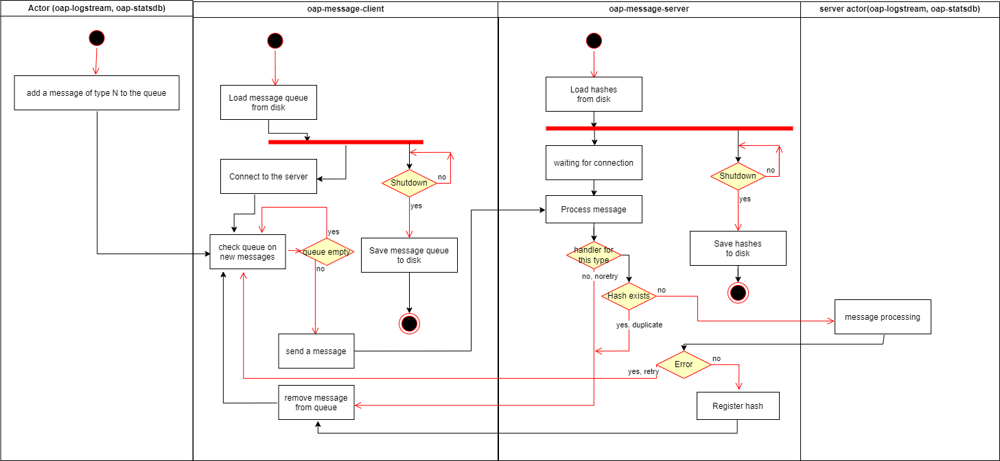

OAP-messages Binary protocol encoding
===============================

This document describes the wire encoding for OAP-messages.

# Contents

* [UML diagram](#uml-diagram)
* [Binary protocol](#binary-protocol)
  * [Binary request encoding](#binary-request-encoding)
  * [Binary response encoding](#binary-response-encoding)

# UML diagram



# Binary protocol

## Binary request encoding
```
+--------+--------+--------+--------+---------+--------+----------------------+
|  mtype |  mver  |clientid|   md5  | reserve |  size  |     bytes            |
+--------+--------+--------+--------+---------+--------+----------------------+
```

Where:
* `mtype` is a single-byte message type. Set by the protocol client. Reserved:
  * *10* - [oap-statsdb](https://github.com/oaplatform/oap-statsdb) 
  * *20* - [oap-logstream](https://github.com/oaplatform/oap-logstream)
* `mver` is a 16-bit number that indicates the version of the data sent by the client.
* `clientid` is a 64-bit number that is a unique customer identifier.
* `md5` is a 16-byte md5
* `reserve` is a 8-byte reserve
* `size` is the size of the byte array, encoded as an int32, positive values only
* `bytes` are the bytes of the byte array.

## Binary response encoding
```
+--------+--------+--------+---------+--------+
|   ver  |clientid|   md5  | reserve | status |
+--------+--------+--------+---------+--------+
```

Where:
* `ver` is a single-byte message version. Current 1.
* `clientid` is a 64-bit number that is a unique customer identifier.
* `md5` is a 16-byte md5
* `reserve` is a 8-byte reserve
* `status` is a 16-bit number that indicates the status of message processing. Reserved statuses:
    * 0 OK
    * 1 Unknown error - (need to resend)
    * 2 Unknown error - (no retry)