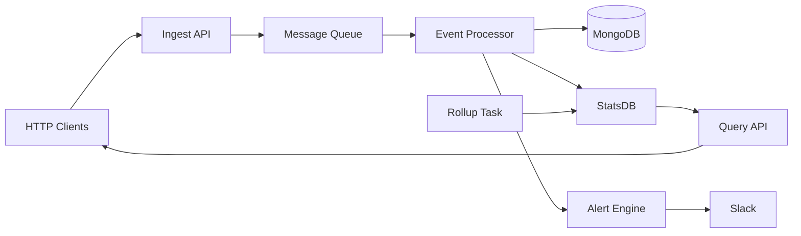

# Advanced Tutorial: Real-time Event Processing Pipeline

## What You'll Build

A production-ready log analytics system that:
- Receives log events via HTTP API
- Processes events in real-time using binary messaging
- Stores events in MongoDB with indexing
- Calculates real-time statistics (requests/sec, error rates)
- Performs periodic data rollups
- Exposes query API for statistics
- Sends Slack alerts on anomalies

**Technologies used:**
- `oap-ws` - REST API endpoints
- `oap-message` - Binary messaging between components
- `oap-storage-mongo` - Event persistence
- `oap-statsdb` - Real-time aggregation
- Scheduled tasks - Periodic rollups
- `oap-alert-slack` - Anomaly alerting

## Learning Objectives

By completing this tutorial, you'll learn:
- Binary messaging patterns with oap-message
- MongoDB integration for high-volume writes
- Real-time aggregation with oap-statsdb
- Scheduled background tasks
- Alert thresholds and notifications
- Production monitoring patterns

## Prerequisites

- Completed the [Getting Started Guide](../getting-started.md)
- Java 17+
- Maven 3.6+
- MongoDB running locally (or use Docker)
- Slack webhook URL (optional, for alerts)

## Architecture



**Data Flow:**
1. Clients POST log events to ingest API
2. Events queued in binary message queue
3. Background processor consumes queue
4. Events stored in MongoDB
5. Real-time stats updated in StatsDB
6. Alert engine checks thresholds
7. Scheduled task performs hourly rollups
8. Query API serves aggregated stats

## Step 1: Project Setup

Create a new Maven project:

```xml
<?xml version="1.0" encoding="UTF-8"?>
<project xmlns="http://maven.apache.org/POM/4.0.0"
         xmlns:xsi="http://www.w3.org/2001/XMLSchema-instance"
         xsi:schemaLocation="http://maven.apache.org/POM/4.0.0
         http://maven.apache.org/xsd/maven-4.0.0.xsd">
    <modelVersion>4.0.0</modelVersion>

    <groupId>com.example</groupId>
    <artifactId>log-analytics</artifactId>
    <version>1.0-SNAPSHOT</version>

    <properties>
        <maven.compiler.source>17</maven.compiler.source>
        <maven.compiler.target>17</maven.compiler.target>
        <oap.version>24.3.2</oap.version>
    </properties>

    <repositories>
        <repository>
            <id>oap</id>
            <url>https://artifacts.oaplatform.org/repository/oap-maven/</url>
        </repository>
    </repositories>

    <dependencies>
        <!-- OAP Framework -->
        <dependency>
            <groupId>oap</groupId>
            <artifactId>oap-application</artifactId>
            <version>${oap.version}</version>
        </dependency>
        <dependency>
            <groupId>oap</groupId>
            <artifactId>oap-ws</artifactId>
            <version>${oap.version}</version>
        </dependency>
        <dependency>
            <groupId>oap</groupId>
            <artifactId>oap-storage-mongo</artifactId>
            <version>${oap.version}</version>
        </dependency>
        <dependency>
            <groupId>oap</groupId>
            <artifactId>oap-message</artifactId>
            <version>${oap.version}</version>
        </dependency>
        <dependency>
            <groupId>oap</groupId>
            <artifactId>oap-statsdb</artifactId>
            <version>${oap.version}</version>
        </dependency>
        <dependency>
            <groupId>oap</groupId>
            <artifactId>oap-alert-slack</artifactId>
            <version>${oap.version}</version>
        </dependency>

        <!-- Lombok -->
        <dependency>
            <groupId>org.projectlombok</groupId>
            <artifactId>lombok</artifactId>
            <version>1.18.30</version>
            <scope>provided</scope>
        </dependency>
    </dependencies>
</project>
```

## Step 2: Domain Model

Create the log event model:

**src/main/java/com/example/model/LogEvent.java:**

```java
package com.example.model;

import lombok.AllArgsConstructor;
import lombok.Data;
import lombok.NoArgsConstructor;
import oap.storage.Id;

@Data
@NoArgsConstructor
@AllArgsConstructor
public class LogEvent {
    @Id
    public String id;

    // Event metadata
    public long timestamp;
    public String source;      // Server/service name
    public String environment; // dev, staging, prod

    // Log data
    public String level;       // INFO, WARN, ERROR
    public String message;
    public String exception;   // Stack trace if error

    // Request context (if applicable)
    public String requestId;
    public String userId;
    public String endpoint;
    public Integer statusCode;
    public Long durationMs;

    // Tags for categorization
    public String[] tags;
}
```

**src/main/java/com/example/model/EventStats.java:**

```java
package com.example.model;

import lombok.Data;

@Data
public class EventStats {
    public String timestamp;      // Hour bucket (e.g., "2024-01-15T14:00:00Z")
    public String source;
    public String level;

    // Counters
    public long count;
    public long errorCount;
    public long warnCount;

    // Performance
    public double avgDurationMs;
    public long maxDurationMs;
    public long p95DurationMs;

    // HTTP stats
    public long http2xx;
    public long http4xx;
    public long http5xx;
}
```

## Step 3: Message Queue

Create a binary message queue for events:

**src/main/java/com/example/queue/EventQueue.java:**

```java
package com.example.queue;

import com.example.model.LogEvent;
import lombok.extern.slf4j.Slf4j;
import oap.message.MessageSender;
import oap.message.MessageListener;
import oap.json.Binder;

import java.util.concurrent.BlockingQueue;
import java.util.concurrent.LinkedBlockingQueue;

@Slf4j
public class EventQueue {
    private final BlockingQueue<LogEvent> queue;
    private final int maxQueueSize;

    public EventQueue(int maxQueueSize) {
        this.maxQueueSize = maxQueueSize;
        this.queue = new LinkedBlockingQueue<>(maxQueueSize);
    }

    /**
     * Add event to queue (non-blocking)
     * Returns false if queue is full
     */
    public boolean offer(LogEvent event) {
        boolean added = queue.offer(event);
        if (!added) {
            log.warn("Queue full, dropping event from {}", event.source);
        }
        return added;
    }

    /**
     * Take event from queue (blocking)
     */
    public LogEvent take() throws InterruptedException {
        return queue.take();
    }

    /**
     * Get current queue size
     */
    public int size() {
        return queue.size();
    }

    /**
     * Get queue capacity
     */
    public int capacity() {
        return maxQueueSize;
    }

    public void start() {
        log.info("Event queue started with capacity {}", maxQueueSize);
    }

    public void stop() {
        log.info("Event queue stopped. {} events remaining", queue.size());
    }
}
```

## Step 4: Event Processor

Create the background processor that consumes events:

**src/main/java/com/example/processor/EventProcessor.java:**

```java
package com.example.processor;

import com.example.model.LogEvent;
import com.example.queue.EventQueue;
import com.example.stats.EventStatsCollector;
import lombok.extern.slf4j.Slf4j;
import oap.storage.mongo.MongoPersistence;

import java.util.ArrayList;
import java.util.List;
import java.util.UUID;

@Slf4j
public class EventProcessor implements Runnable {
    private final EventQueue queue;
    private final MongoPersistence<LogEvent> storage;
    private final EventStatsCollector statsCollector;
    private final int batchSize;
    private final int batchTimeoutMs;

    private volatile boolean running = true;

    public EventProcessor(
            EventQueue queue,
            MongoPersistence<LogEvent> storage,
            EventStatsCollector statsCollector,
            int batchSize,
            int batchTimeoutMs) {
        this.queue = queue;
        this.storage = storage;
        this.statsCollector = statsCollector;
        this.batchSize = batchSize;
        this.batchTimeoutMs = batchTimeoutMs;
    }

    @Override
    public void run() {
        log.info("Event processor started (batch size: {}, timeout: {}ms)",
            batchSize, batchTimeoutMs);

        List<LogEvent> batch = new ArrayList<>(batchSize);
        long lastBatchTime = System.currentTimeMillis();

        while (running) {
            try {
                // Try to take an event (with timeout)
                LogEvent event = queue.take();

                // Assign ID if missing
                if (event.id == null) {
                    event.id = UUID.randomUUID().toString();
                }

                batch.add(event);

                // Update real-time stats
                statsCollector.record(event);

                // Flush batch if full or timeout reached
                long now = System.currentTimeMillis();
                boolean batchFull = batch.size() >= batchSize;
                boolean timeoutReached = (now - lastBatchTime) >= batchTimeoutMs;

                if (batchFull || timeoutReached) {
                    flushBatch(batch);
                    batch.clear();
                    lastBatchTime = now;
                }

            } catch (InterruptedException e) {
                Thread.currentThread().interrupt();
                log.info("Event processor interrupted");
                break;
            } catch (Exception e) {
                log.error("Error processing event", e);
            }
        }

        // Flush remaining events
        if (!batch.isEmpty()) {
            flushBatch(batch);
        }

        log.info("Event processor stopped");
    }

    private void flushBatch(List<LogEvent> batch) {
        if (batch.isEmpty()) return;

        try {
            long start = System.currentTimeMillis();

            // Batch insert to MongoDB
            for (LogEvent event : batch) {
                storage.store(event);
            }

            long duration = System.currentTimeMillis() - start;
            log.debug("Flushed {} events to storage in {}ms",
                batch.size(), duration);

        } catch (Exception e) {
            log.error("Failed to flush batch of {} events", batch.size(), e);
        }
    }

    public void preStop() {
        running = false;
    }
}
```

## Step 5: Real-time Statistics

Create a collector for real-time stats using StatsDB:

**src/main/java/com/example/stats/EventStatsCollector.java:**

```java
package com.example.stats;

import com.example.model.LogEvent;
import lombok.extern.slf4j.Slf4j;
import oap.statsdb.StatsDB;

import java.time.Instant;
import java.time.ZoneOffset;
import java.time.format.DateTimeFormatter;
import java.util.HashMap;
import java.util.Map;

@Slf4j
public class EventStatsCollector {
    private final StatsDB statsDB;

    public EventStatsCollector(StatsDB statsDB) {
        this.statsDB = statsDB;
    }

    /**
     * Record event in real-time statistics
     */
    public void record(LogEvent event) {
        try {
            String hourBucket = getHourBucket(event.timestamp);
            String key = String.format("%s:%s:%s",
                hourBucket, event.source, event.level);

            Map<String, Object> stats = new HashMap<>();
            stats.put("count", 1);

            // Count by level
            if ("ERROR".equals(event.level)) {
                stats.put("errorCount", 1);
            } else if ("WARN".equals(event.level)) {
                stats.put("warnCount", 1);
            }

            // Duration stats
            if (event.durationMs != null) {
                stats.put("durationMs", event.durationMs);
                stats.put("durationCount", 1);
            }

            // HTTP status stats
            if (event.statusCode != null) {
                if (event.statusCode >= 200 && event.statusCode < 300) {
                    stats.put("http2xx", 1);
                } else if (event.statusCode >= 400 && event.statusCode < 500) {
                    stats.put("http4xx", 1);
                } else if (event.statusCode >= 500) {
                    stats.put("http5xx", 1);
                }
            }

            // Update StatsDB
            statsDB.update(key, stats);

        } catch (Exception e) {
            log.error("Failed to record stats for event {}", event.id, e);
        }
    }

    /**
     * Get hour bucket for timestamp (e.g., "2024-01-15T14:00:00Z")
     */
    private String getHourBucket(long timestamp) {
        Instant instant = Instant.ofEpochMilli(timestamp);
        return instant.atZone(ZoneOffset.UTC)
            .withMinute(0)
            .withSecond(0)
            .withNano(0)
            .format(DateTimeFormatter.ISO_INSTANT);
    }

    public void start() {
        log.info("Event stats collector started");
    }

    public void stop() {
        log.info("Event stats collector stopped");
    }
}
```

## Step 6: Alert Engine

Create an alert engine that monitors for anomalies:

**src/main/java/com/example/alerts/AlertEngine.java:**

```java
package com.example.alerts;

import com.example.model.LogEvent;
import lombok.extern.slf4j.Slf4j;
import oap.alert.slack.SlackMessenger;

import java.util.concurrent.atomic.AtomicInteger;

@Slf4j
public class AlertEngine {
    private final SlackMessenger slack;
    private final int errorThreshold;
    private final long windowMs;

    private final AtomicInteger errorCount = new AtomicInteger(0);
    private volatile long windowStart = System.currentTimeMillis();

    public AlertEngine(SlackMessenger slack, int errorThreshold, long windowMs) {
        this.slack = slack;
        this.errorThreshold = errorThreshold;
        this.windowMs = windowMs;
    }

    /**
     * Check event and send alert if threshold exceeded
     */
    public void checkEvent(LogEvent event) {
        if (!"ERROR".equals(event.level)) {
            return;
        }

        long now = System.currentTimeMillis();
        long elapsed = now - windowStart;

        // Reset window if expired
        if (elapsed > windowMs) {
            errorCount.set(0);
            windowStart = now;
        }

        // Increment error count
        int errors = errorCount.incrementAndGet();

        // Send alert if threshold exceeded
        if (errors == errorThreshold) {
            sendAlert(event, errors);
        }
    }

    private void sendAlert(LogEvent event, int errorCount) {
        try {
            String message = String.format(
                "⚠️ *Error Threshold Exceeded*\n" +
                "Source: `%s`\n" +
                "Errors: %d in %d seconds\n" +
                "Last error: %s\n" +
                "Environment: `%s`",
                event.source,
                errorCount,
                windowMs / 1000,
                event.message,
                event.environment
            );

            slack.send("alerts", message, "danger");
            log.warn("Alert sent: {} errors from {} in {}ms",
                errorCount, event.source, windowMs);

        } catch (Exception e) {
            log.error("Failed to send alert", e);
        }
    }

    public void start() {
        log.info("Alert engine started (threshold: {} errors per {}ms)",
            errorThreshold, windowMs);
    }

    public void stop() {
        log.info("Alert engine stopped");
    }
}
```

## Step 7: Rollup Task

Create a scheduled task for hourly rollups:

**src/main/java/com/example/tasks/StatsRollupTask.java:**

```java
package com.example.tasks;

import lombok.extern.slf4j.Slf4j;
import oap.statsdb.StatsDB;

@Slf4j
public class StatsRollupTask implements Runnable {
    private final StatsDB statsDB;

    public StatsRollupTask(StatsDB statsDB) {
        this.statsDB = statsDB;
    }

    @Override
    public void run() {
        try {
            log.info("Starting stats rollup...");

            // Perform aggregation and cleanup
            long recordsProcessed = performRollup();

            log.info("Stats rollup completed. Processed {} records",
                recordsProcessed);

        } catch (Exception e) {
            log.error("Error during stats rollup", e);
        }
    }

    private long performRollup() {
        // In a real implementation, you would:
        // 1. Aggregate detailed stats into hourly buckets
        // 2. Calculate percentiles and other derived metrics
        // 3. Archive old data
        // 4. Clean up memory

        // For this tutorial, we'll just log the operation
        log.debug("Performing rollup aggregation");
        return 0;
    }
}
```

## Step 8: REST APIs

Create the ingest and query APIs:

**src/main/java/com/example/api/IngestAPI.java:**

```java
package com.example.api;

import com.example.model.LogEvent;
import com.example.queue.EventQueue;
import com.example.alerts.AlertEngine;
import lombok.extern.slf4j.Slf4j;
import oap.http.Http;
import oap.ws.Response;
import oap.ws.WsMethod;
import oap.ws.WsParam;
import oap.ws.validate.WsValidate;

import java.util.List;

import static oap.ws.WsParam.From.BODY;

@Slf4j
public class IngestAPI {
    private final EventQueue queue;
    private final AlertEngine alertEngine;

    public IngestAPI(EventQueue queue, AlertEngine alertEngine) {
        this.queue = queue;
        this.alertEngine = alertEngine;
    }

    @WsMethod(path = "/api/v1/events", method = "POST")
    @WsValidate({
        "required:timestamp",
        "required:source",
        "required:level",
        "required:message"
    })
    public Response ingestEvent(@WsParam(from = BODY) LogEvent event) {
        // Set timestamp if missing
        if (event.timestamp == 0) {
            event.timestamp = System.currentTimeMillis();
        }

        // Add to queue
        boolean added = queue.offer(event);

        if (!added) {
            return Response
                .status(Http.StatusCode.SERVICE_UNAVAILABLE)
                .response("Queue full, try again later");
        }

        // Check for alerts
        alertEngine.checkEvent(event);

        log.debug("Event queued from {}: {}", event.source, event.level);

        return Response
            .status(Http.StatusCode.ACCEPTED)
            .response(new IngestResponse(event.id, queue.size()));
    }

    @WsMethod(path = "/api/v1/events/batch", method = "POST")
    public Response ingestBatch(@WsParam(from = BODY) List<LogEvent> events) {
        int accepted = 0;
        int rejected = 0;

        for (LogEvent event : events) {
            if (event.timestamp == 0) {
                event.timestamp = System.currentTimeMillis();
            }

            if (queue.offer(event)) {
                accepted++;
                alertEngine.checkEvent(event);
            } else {
                rejected++;
            }
        }

        log.info("Batch ingested: {} accepted, {} rejected", accepted, rejected);

        return Response.ok(new BatchIngestResponse(accepted, rejected, queue.size()));
    }

    public static class IngestResponse {
        public String eventId;
        public int queueSize;

        public IngestResponse(String eventId, int queueSize) {
            this.eventId = eventId;
            this.queueSize = queueSize;
        }
    }

    public static class BatchIngestResponse {
        public int accepted;
        public int rejected;
        public int queueSize;

        public BatchIngestResponse(int accepted, int rejected, int queueSize) {
            this.accepted = accepted;
            this.rejected = rejected;
            this.queueSize = queueSize;
        }
    }
}
```

**src/main/java/com/example/api/QueryAPI.java:**

```java
package com.example.api;

import com.example.model.EventStats;
import lombok.extern.slf4j.Slf4j;
import oap.statsdb.StatsDB;
import oap.ws.WsMethod;
import oap.ws.WsParam;

import java.util.ArrayList;
import java.util.List;
import java.util.Map;
import java.util.Optional;

import static oap.ws.WsParam.From.QUERY;

@Slf4j
public class QueryAPI {
    private final StatsDB statsDB;

    public QueryAPI(StatsDB statsDB) {
        this.statsDB = statsDB;
    }

    @WsMethod(path = "/api/v1/stats", method = "GET")
    public List<EventStats> getStats(
            @WsParam(from = QUERY) Optional<String> source,
            @WsParam(from = QUERY) Optional<String> level,
            @WsParam(from = QUERY) Optional<Integer> limit) {

        List<EventStats> results = new ArrayList<>();

        // Query StatsDB
        Map<String, Map<String, Object>> allStats = statsDB.getAll();

        for (Map.Entry<String, Map<String, Object>> entry : allStats.entrySet()) {
            String key = entry.getKey();
            Map<String, Object> stats = entry.getValue();

            // Parse key: "timestamp:source:level"
            String[] parts = key.split(":");
            if (parts.length != 3) continue;

            // Filter by source
            if (source.isPresent() && !parts[1].equals(source.get())) {
                continue;
            }

            // Filter by level
            if (level.isPresent() && !parts[2].equals(level.get())) {
                continue;
            }

            // Build stats object
            EventStats eventStats = new EventStats();
            eventStats.timestamp = parts[0];
            eventStats.source = parts[1];
            eventStats.level = parts[2];
            eventStats.count = getLong(stats, "count");
            eventStats.errorCount = getLong(stats, "errorCount");
            eventStats.warnCount = getLong(stats, "warnCount");
            eventStats.http2xx = getLong(stats, "http2xx");
            eventStats.http4xx = getLong(stats, "http4xx");
            eventStats.http5xx = getLong(stats, "http5xx");

            // Calculate averages
            long durationCount = getLong(stats, "durationCount");
            if (durationCount > 0) {
                long totalDuration = getLong(stats, "durationMs");
                eventStats.avgDurationMs = (double) totalDuration / durationCount;
            }

            results.add(eventStats);
        }

        // Apply limit
        int maxResults = limit.orElse(100);
        if (results.size() > maxResults) {
            results = results.subList(0, maxResults);
        }

        return results;
    }

    @WsMethod(path = "/api/v1/stats/summary", method = "GET")
    public StatsSummary getSummary() {
        Map<String, Map<String, Object>> allStats = statsDB.getAll();

        long totalEvents = 0;
        long totalErrors = 0;

        for (Map<String, Object> stats : allStats.values()) {
            totalEvents += getLong(stats, "count");
            totalErrors += getLong(stats, "errorCount");
        }

        StatsSummary summary = new StatsSummary();
        summary.totalEvents = totalEvents;
        summary.totalErrors = totalErrors;
        summary.errorRate = totalEvents > 0
            ? (double) totalErrors / totalEvents
            : 0.0;

        return summary;
    }

    private long getLong(Map<String, Object> map, String key) {
        Object value = map.get(key);
        if (value instanceof Number) {
            return ((Number) value).longValue();
        }
        return 0;
    }

    public static class StatsSummary {
        public long totalEvents;
        public long totalErrors;
        public double errorRate;
    }
}
```

## Step 9: Module Configuration

Create the module configuration:

**src/main/resources/META-INF/oap-module.conf:**

```hocon
name = log-analytics

services {
    # Event queue
    event-queue {
        implementation = com.example.queue.EventQueue
        parameters {
            maxQueueSize = 10000
        }
        supervision.supervise = true
    }

    # MongoDB storage for events
    event-storage {
        implementation = oap.storage.mongo.MongoPersistence
        parameters {
            database = "log_analytics"
            collection = "events"
            mongoClient = <modules.oap-storage-mongo.oap-mongo-client>
        }
        supervision.supervise = true
    }

    # StatsDB for real-time aggregation
    stats-db {
        implementation = oap.statsdb.StatsDB
        parameters {
            # Configuration for StatsDB
        }
        supervision.supervise = true
    }

    # Stats collector
    stats-collector {
        implementation = com.example.stats.EventStatsCollector
        parameters {
            statsDB = <modules.this.stats-db>
        }
        supervision.supervise = true
    }

    # Slack messenger for alerts
    slack-messenger {
        implementation = oap.alert.slack.SlackMessenger
        parameters {
            webhookUrl = ${?SLACK_WEBHOOK_URL}
        }
    }

    # Alert engine
    alert-engine {
        implementation = com.example.alerts.AlertEngine
        parameters {
            slack = <modules.this.slack-messenger>
            errorThreshold = 10      # 10 errors
            windowMs = 60000         # in 1 minute
        }
        supervision.supervise = true
    }

    # Event processor (background thread)
    event-processor {
        implementation = com.example.processor.EventProcessor
        parameters {
            queue = <modules.this.event-queue>
            storage = <modules.this.event-storage>
            statsCollector = <modules.this.stats-collector>
            batchSize = 100
            batchTimeoutMs = 5000
        }
        supervision {
            supervise = true
            thread = true  # Run in background
        }
    }

    # Hourly rollup task
    rollup-task {
        implementation = com.example.tasks.StatsRollupTask
        parameters {
            statsDB = <modules.this.stats-db>
        }
        supervision {
            supervise = true
            schedule = true
            cron = "0 0 * * * ?"  # Every hour
        }
    }

    # Ingest API
    ingest-api {
        implementation = com.example.api.IngestAPI
        parameters {
            queue = <modules.this.event-queue>
            alertEngine = <modules.this.alert-engine>
        }
    }

    # Query API
    query-api {
        implementation = com.example.api.QueryAPI
        parameters {
            statsDB = <modules.this.stats-db>
        }
    }

    # Register web services
    web-services {
        implementation = oap.ws.WebServices
        parameters {
            services = [
                <modules.this.ingest-api>
                <modules.this.query-api>
            ]
        }
    }
}
```

## Step 10: Application Configuration

**application.conf:**

```hocon
boot.main = [
    oap-http
    oap-ws
    oap-storage-mongo
    oap-statsdb
    oap-alert-slack
    log-analytics
]

services {
    # HTTP Server
    oap-http.oap-http-server.parameters {
        defaultPort.httpPort = 8080
    }

    # MongoDB
    oap-storage-mongo.oap-mongo-client.parameters {
        connectionString = "mongodb://localhost:27017"
        connectionString = ${?MONGO_URL}
    }

    # Slack (optional)
    log-analytics.slack-messenger.parameters {
        webhookUrl = ${?SLACK_WEBHOOK_URL}
    }
}
```

## Step 11: Run the Application

**Start MongoDB:**

```bash
docker run -d -p 27017:27017 --name mongodb mongo:latest
```

**Build and run:**

```bash
mvn clean package
mvn exec:java -Dexec.mainClass="com.example.LogAnalyticsApp"
```

## Step 12: Test the System

**Ingest a single event:**

```bash
curl -X POST http://localhost:8080/api/v1/events \
  -H "Content-Type: application/json" \
  -d '{
    "timestamp": '$(date +%s000)',
    "source": "web-server-01",
    "environment": "production",
    "level": "INFO",
    "message": "Request processed successfully",
    "endpoint": "/api/users",
    "statusCode": 200,
    "durationMs": 45
  }'
```

**Ingest a batch:**

```bash
curl -X POST http://localhost:8080/api/v1/events/batch \
  -H "Content-Type: application/json" \
  -d '[
    {
      "source": "web-server-01",
      "level": "ERROR",
      "message": "Database connection failed",
      "exception": "Connection timeout"
    },
    {
      "source": "web-server-02",
      "level": "WARN",
      "message": "Slow query detected",
      "durationMs": 1500
    }
  ]'
```

**Query statistics:**

```bash
# Get all stats
curl http://localhost:8080/api/v1/stats

# Filter by source
curl "http://localhost:8080/api/v1/stats?source=web-server-01"

# Get summary
curl http://localhost:8080/api/v1/stats/summary
```

**Generate test load:**

```bash
# Bash script to generate events
for i in {1..1000}; do
  curl -X POST http://localhost:8080/api/v1/events \
    -H "Content-Type: application/json" \
    -d "{
      \"source\": \"load-test\",
      \"level\": \"INFO\",
      \"message\": \"Test event $i\",
      \"statusCode\": 200
    }" &
done
wait
```

## Monitoring

**Check queue size:**

The ingest response includes `queueSize` to monitor backlog.

**MongoDB queries:**

```javascript
// Connect to MongoDB
use log_analytics

// Count events
db.events.count()

// Find recent errors
db.events.find({ level: "ERROR" }).sort({ timestamp: -1 }).limit(10)

// Aggregate by source
db.events.aggregate([
  { $group: { _id: "$source", count: { $sum: 1 } } }
])
```

**StatsDB queries:**

Query the `/api/v1/stats` endpoint to see real-time aggregations.

## Production Considerations

### 1. Scaling

**Horizontal scaling:**
```hocon
event-processor-1 {
    implementation = com.example.processor.EventProcessor
    # ... same config
}
event-processor-2 {
    implementation = com.example.processor.EventProcessor
    # ... same config
}
```

Multiple processors can consume from the same queue.

### 2. Persistence

Add disk-backed queue for durability:

```java
// Use oap-message with file-based persistence
MessagePersistence persistence = new FilePersistence("./queue");
```

### 3. Monitoring

Add metrics:

```java
@WsMethod(path = "/metrics/queue")
public QueueMetrics getQueueMetrics() {
    return new QueueMetrics(
        queue.size(),
        queue.capacity(),
        (double) queue.size() / queue.capacity()
    );
}
```

### 4. Error Handling

Add dead letter queue for failed events:

```java
private void handleFailedEvent(LogEvent event, Exception error) {
    deadLetterQueue.offer(event);
    log.error("Event processing failed: {}", event.id, error);
}
```

### 5. Data Retention

Add TTL index in MongoDB:

```javascript
db.events.createIndex(
  { "timestamp": 1 },
  { expireAfterSeconds: 2592000 }  // 30 days
)
```

## What You've Learned

✅ **Binary messaging** - Queue-based event processing
✅ **MongoDB integration** - High-volume event storage
✅ **Real-time aggregation** - StatsDB for live metrics
✅ **Background processing** - Thread-based event consumers
✅ **Scheduled tasks** - Cron-based rollups
✅ **Alert thresholds** - Slack notifications
✅ **REST APIs** - Ingest and query endpoints
✅ **Batch processing** - Efficient bulk operations
✅ **Production patterns** - Monitoring, scaling, retention

## Next Steps

- Add authentication to APIs using oap-ws-sso
- Implement data retention policies
- Add Prometheus metrics
- Create dashboard with visualization
- Add more complex aggregations (percentiles, histograms)
- Implement distributed tracing

## See Also

- [OAP Message Documentation](../../oap-message/README.md)
- [OAP Storage MongoDB](../../oap-storage/README.md)
- [OAP StatsDB](../../oap-statsdb/README.md)
- [OAP Alert Slack](../../oap-alert-slack/README.md)
- [Developer Guide](../developer-guide.md)
