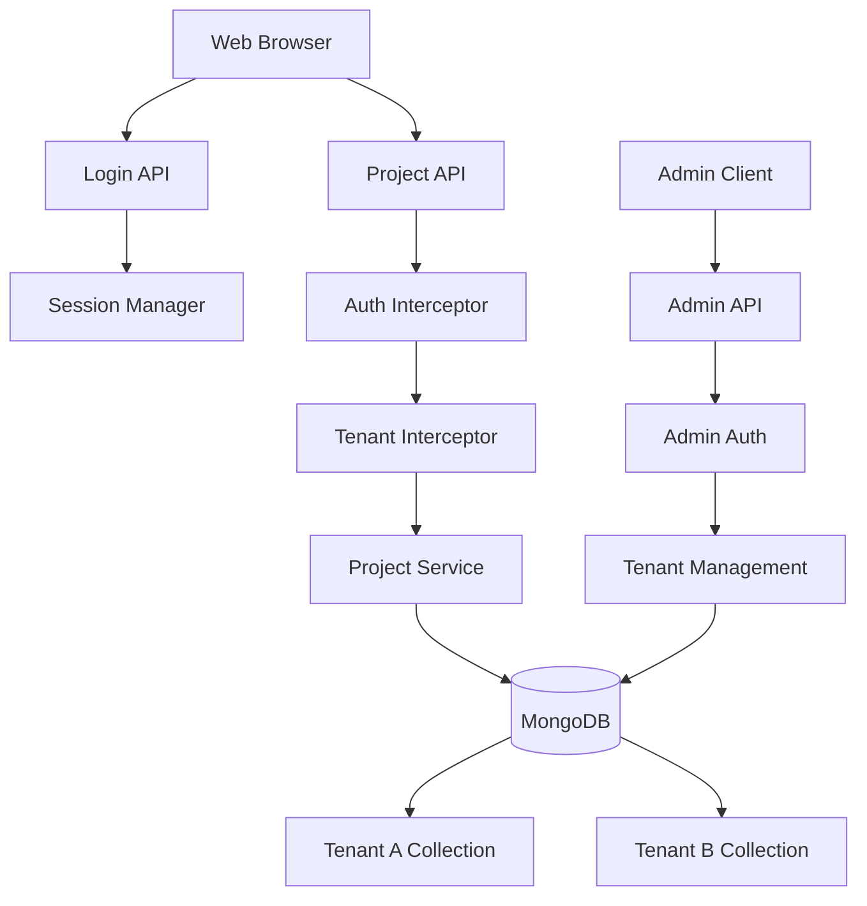

# Advanced Tutorial: Multi-tenant SaaS Application

## What You'll Build

A production-ready multi-tenant project management SaaS with:
- User authentication with sessions
- Tenant isolation (data segregation by organization)
- Role-based access control (RBAC)
- Tenant-specific database collections
- API rate limiting per tenant
- Health checks with custom providers
- Prometheus metrics by tenant
- Admin API for tenant management

**Technologies used:**
- `oap-ws-sso` - Session management and authentication
- `oap-ws` - REST APIs with interceptors
- `oap-storage-mongo` - Multi-tenant data storage
- Abstract services - Pluggable storage backends
- `oap-http-prometheus` - Metrics export
- Interceptors - Tenant isolation middleware

## Learning Objectives

By completing this tutorial, you'll learn:
- Multi-tenant architecture patterns
- Session-based authentication
- Tenant isolation strategies
- Role-based access control
- Custom interceptors for cross-cutting concerns
- Health checks and monitoring
- Metrics collection by tenant
- Admin vs. user API separation

## Prerequisites

- Completed the [Getting Started Guide](../getting-started.md)
- Java 17+
- Maven 3.6+
- MongoDB running locally

## Architecture



**Key Concepts:**
1. **Session-based auth** - Cookies for user sessions
2. **Tenant context** - Interceptor injects tenant ID from session
3. **Data isolation** - Each tenant gets separate MongoDB collection
4. **RBAC** - Role check in interceptor (admin, member, viewer)
5. **Rate limiting** - Per-tenant API quotas

## Step 1: Project Setup

**pom.xml:**

```xml
<?xml version="1.0" encoding="UTF-8"?>
<project xmlns="http://maven.apache.org/POM/4.0.0"
         xmlns:xsi="http://www.w3.org/2001/XMLSchema-instance"
         xsi:schemaLocation="http://maven.apache.org/POM/4.0.0
         http://maven.apache.org/xsd/maven-4.0.0.xsd">
    <modelVersion>4.0.0</modelVersion>

    <groupId>com.example</groupId>
    <artifactId>project-saas</artifactId>
    <version>1.0-SNAPSHOT</version>

    <properties>
        <maven.compiler.source>17</maven.compiler.source>
        <maven.compiler.target>17</maven.compiler.target>
        <oap.version>24.3.2</oap.version>
    </properties>

    <repositories>
        <repository>
            <id>oap</id>
            <url>https://artifacts.oaplatform.org/repository/oap-maven/</url>
        </repository>
    </repositories>

    <dependencies>
        <dependency>
            <groupId>oap</groupId>
            <artifactId>oap-application</artifactId>
            <version>${oap.version}</version>
        </dependency>
        <dependency>
            <groupId>oap</groupId>
            <artifactId>oap-ws</artifactId>
            <version>${oap.version}</version>
        </dependency>
        <dependency>
            <groupId>oap</groupId>
            <artifactId>oap-ws-sso</artifactId>
            <version>${oap.version}</version>
        </dependency>
        <dependency>
            <groupId>oap</groupId>
            <artifactId>oap-storage-mongo</artifactId>
            <version>${oap.version}</version>
        </dependency>
        <dependency>
            <groupId>oap</groupId>
            <artifactId>oap-http-prometheus</artifactId>
            <version>${oap.version}</version>
        </dependency>
        <dependency>
            <groupId>org.projectlombok</groupId>
            <artifactId>lombok</artifactId>
            <version>1.18.30</version>
            <scope>provided</scope>
        </dependency>
        <dependency>
            <groupId>org.mindrot</groupId>
            <artifactId>jbcrypt</artifactId>
            <version>0.4</version>
        </dependency>
    </dependencies>
</project>
```

## Step 2: Domain Models

**src/main/java/com/example/model/Tenant.java:**

```java
package com.example.model;

import lombok.Data;
import oap.storage.Id;

@Data
public class Tenant {
    @Id
    public String id;
    public String name;
    public String domain;        // e.g., "acme" for acme.example.com
    public String plan;          // free, pro, enterprise
    public long createdAt;
    public boolean active = true;

    // Quotas
    public int maxUsers = 10;
    public int maxProjects = 50;
    public int apiRateLimit = 100;  // requests per minute
}
```

**src/main/java/com/example/model/User.java:**

```java
package com.example.model;

import lombok.Data;
import oap.storage.Id;

@Data
public class User {
    @Id
    public String id;
    public String tenantId;
    public String email;
    public String passwordHash;
    public String name;
    public Role role;
    public long createdAt;
    public boolean active = true;

    public enum Role {
        ADMIN,    // Full access
        MEMBER,   // Can create/edit
        VIEWER    // Read-only
    }
}
```

**src/main/java/com/example/model/Project.java:**

```java
package com.example.model;

import lombok.Data;
import oap.storage.Id;

import java.util.ArrayList;
import java.util.List;

@Data
public class Project {
    @Id
    public String id;
    public String tenantId;    // For data isolation
    public String name;
    public String description;
    public String ownerId;     // User who created it
    public List<String> memberIds = new ArrayList<>();
    public Status status = Status.ACTIVE;
    public long createdAt;
    public long updatedAt;

    public enum Status {
        ACTIVE,
        ARCHIVED,
        DELETED
    }
}
```

**src/main/java/com/example/model/UserSession.java:**

```java
package com.example.model;

import lombok.Data;

@Data
public class UserSession {
    public String userId;
    public String tenantId;
    public String email;
    public User.Role role;
    public long createdAt;
}
```

## Step 3: Authentication Service

**src/main/java/com/example/service/AuthService.java:**

```java
package com.example.service;

import com.example.model.User;
import com.example.model.UserSession;
import lombok.extern.slf4j.Slf4j;
import oap.storage.mongo.MongoPersistence;
import oap.util.Result;
import org.mindrot.jbcrypt.BCrypt;

import java.util.Optional;
import java.util.UUID;

@Slf4j
public class AuthService {
    private final MongoPersistence<User> userStorage;

    public AuthService(MongoPersistence<User> userStorage) {
        this.userStorage = userStorage;
    }

    /**
     * Authenticate user by email and password
     */
    public Result<UserSession, String> authenticate(String email, String password) {
        Optional<User> userOpt = findUserByEmail(email);

        if (userOpt.isEmpty()) {
            log.warn("Login failed: user not found - {}", email);
            return Result.failure("Invalid credentials");
        }

        User user = userOpt.get();

        if (!user.active) {
            log.warn("Login failed: user inactive - {}", email);
            return Result.failure("Account is inactive");
        }

        // Verify password
        if (!BCrypt.checkpw(password, user.passwordHash)) {
            log.warn("Login failed: invalid password - {}", email);
            return Result.failure("Invalid credentials");
        }

        // Create session
        UserSession session = new UserSession();
        session.userId = user.id;
        session.tenantId = user.tenantId;
        session.email = user.email;
        session.role = user.role;
        session.createdAt = System.currentTimeMillis();

        log.info("User logged in: {} (tenant: {})", email, user.tenantId);

        return Result.success(session);
    }

    /**
     * Register new user
     */
    public Result<User, String> register(String tenantId, String email,
                                         String password, String name,
                                         User.Role role) {
        // Check if user exists
        if (findUserByEmail(email).isPresent()) {
            return Result.failure("Email already registered");
        }

        // Create user
        User user = new User();
        user.id = UUID.randomUUID().toString();
        user.tenantId = tenantId;
        user.email = email;
        user.passwordHash = BCrypt.hashpw(password, BCrypt.gensalt());
        user.name = name;
        user.role = role;
        user.createdAt = System.currentTimeMillis();
        user.active = true;

        userStorage.store(user);

        log.info("User registered: {} (tenant: {})", email, tenantId);

        return Result.success(user);
    }

    private Optional<User> findUserByEmail(String email) {
        return userStorage.list().stream()
            .filter(u -> u.email.equals(email))
            .findFirst();
    }
}
```

## Step 4: Multi-tenant Storage

Create a storage factory that provides tenant-specific storage:

**src/main/java/com/example/storage/TenantStorageFactory.java:**

```java
package com.example.storage;

import com.example.model.Project;
import lombok.extern.slf4j.Slf4j;
import oap.storage.mongo.MongoClient;
import oap.storage.mongo.MongoPersistence;

import java.util.concurrent.ConcurrentHashMap;

@Slf4j
public class TenantStorageFactory {
    private final MongoClient mongoClient;
    private final String database;
    private final ConcurrentHashMap<String, MongoPersistence<Project>> storageCache;

    public TenantStorageFactory(MongoClient mongoClient, String database) {
        this.mongoClient = mongoClient;
        this.database = database;
        this.storageCache = new ConcurrentHashMap<>();
    }

    /**
     * Get storage for specific tenant
     * Each tenant gets a separate collection
     */
    public MongoPersistence<Project> getProjectStorage(String tenantId) {
        return storageCache.computeIfAbsent(tenantId, tid -> {
            String collectionName = "projects_" + tid;
            log.info("Creating project storage for tenant: {} (collection: {})",
                tid, collectionName);

            return new MongoPersistence<>(
                Project.class,
                mongoClient,
                database,
                collectionName
            );
        });
    }

    /**
     * Initialize storage for new tenant
     */
    public void initializeTenant(String tenantId) {
        MongoPersistence<Project> storage = getProjectStorage(tenantId);
        // Create indexes
        // storage.createIndex(...);
        log.info("Tenant storage initialized: {}", tenantId);
    }

    public void start() {
        log.info("Tenant storage factory started");
    }

    public void stop() {
        storageCache.values().forEach(storage -> {
            try {
                storage.stop();
            } catch (Exception e) {
                log.error("Error stopping storage", e);
            }
        });
        log.info("Tenant storage factory stopped");
    }
}
```

## Step 5: Tenant Context Interceptor

Create an interceptor that extracts and validates tenant context:

**src/main/java/com/example/interceptor/TenantInterceptor.java:**

```java
package com.example.interceptor;

import com.example.model.UserSession;
import io.undertow.server.HttpServerExchange;
import lombok.extern.slf4j.Slf4j;
import oap.http.Http;
import oap.ws.interceptor.Interceptor;
import oap.ws.sso.SSO;
import oap.ws.sso.SessionStorage;
import oap.ws.WsException;

import java.util.Optional;

@Slf4j
public class TenantInterceptor implements Interceptor {
    public static final String TENANT_ID_KEY = "tenantId";
    public static final String USER_SESSION_KEY = "userSession";

    private final SessionStorage sessionStorage;

    public TenantInterceptor(SessionStorage sessionStorage) {
        this.sessionStorage = sessionStorage;
    }

    @Override
    public void before(HttpServerExchange exchange) {
        // Skip for login/public endpoints
        String path = exchange.getRequestPath();
        if (path.startsWith("/api/auth/") || path.startsWith("/health")) {
            return;
        }

        // Get session from cookie
        String sessionId = SSO.getSessionId(exchange);
        if (sessionId == null) {
            throw new WsException(Http.StatusCode.UNAUTHORIZED,
                "No session found");
        }

        // Load session
        Optional<UserSession> sessionOpt = sessionStorage.get(sessionId);
        if (sessionOpt.isEmpty()) {
            throw new WsException(Http.StatusCode.UNAUTHORIZED,
                "Invalid or expired session");
        }

        UserSession session = sessionOpt.get();

        // Store in exchange for use by services
        exchange.putAttachment(TENANT_ID_KEY, session.tenantId);
        exchange.putAttachment(USER_SESSION_KEY, session);

        log.debug("Request from tenant: {}, user: {}",
            session.tenantId, session.email);
    }

    @Override
    public void after(HttpServerExchange exchange) {
        // Cleanup if needed
    }

    /**
     * Helper to get tenant ID from exchange
     */
    public static String getTenantId(HttpServerExchange exchange) {
        String tenantId = exchange.getAttachment(TENANT_ID_KEY);
        if (tenantId == null) {
            throw new WsException(Http.StatusCode.INTERNAL_SERVER_ERROR,
                "Tenant context not set");
        }
        return tenantId;
    }

    /**
     * Helper to get user session from exchange
     */
    public static UserSession getUserSession(HttpServerExchange exchange) {
        UserSession session = exchange.getAttachment(USER_SESSION_KEY);
        if (session == null) {
            throw new WsException(Http.StatusCode.INTERNAL_SERVER_ERROR,
                "User session not set");
        }
        return session;
    }
}
```

## Step 6: Role-based Authorization Interceptor

**src/main/java/com/example/interceptor/AuthorizationInterceptor.java:**

```java
package com.example.interceptor;

import com.example.model.User;
import com.example.model.UserSession;
import io.undertow.server.HttpServerExchange;
import lombok.extern.slf4j.Slf4j;
import oap.http.Http;
import oap.ws.interceptor.Interceptor;
import oap.ws.WsException;

import java.util.Set;

@Slf4j
public class AuthorizationInterceptor implements Interceptor {
    private final Set<String> adminOnlyPaths;

    public AuthorizationInterceptor(Set<String> adminOnlyPaths) {
        this.adminOnlyPaths = adminOnlyPaths;
    }

    @Override
    public void before(HttpServerExchange exchange) {
        String path = exchange.getRequestPath();
        String method = exchange.getRequestMethod().toString();

        // Skip for public endpoints
        if (path.startsWith("/api/auth/") || path.startsWith("/health")) {
            return;
        }

        UserSession session = TenantInterceptor.getUserSession(exchange);

        // Check admin-only paths
        if (isAdminOnlyPath(path)) {
            if (session.role != User.Role.ADMIN) {
                log.warn("Unauthorized access attempt to {} by user {} (role: {})",
                    path, session.email, session.role);
                throw new WsException(Http.StatusCode.FORBIDDEN,
                    "Admin access required");
            }
        }

        // Check write permissions (POST, PUT, DELETE)
        if (isWriteMethod(method) && session.role == User.Role.VIEWER) {
            log.warn("Write attempt by viewer: {} {}", method, path);
            throw new WsException(Http.StatusCode.FORBIDDEN,
                "Viewer role cannot modify data");
        }

        log.debug("Authorized: {} {} for user {} (role: {})",
            method, path, session.email, session.role);
    }

    private boolean isAdminOnlyPath(String path) {
        return adminOnlyPaths.stream()
            .anyMatch(path::startsWith);
    }

    private boolean isWriteMethod(String method) {
        return method.equals("POST") ||
               method.equals("PUT") ||
               method.equals("DELETE");
    }

    @Override
    public void after(HttpServerExchange exchange) {
        // No-op
    }
}
```

## Step 7: Project Service

**src/main/java/com/example/service/ProjectService.java:**

```java
package com.example.service;

import com.example.model.Project;
import com.example.model.User;
import com.example.model.UserSession;
import com.example.storage.TenantStorageFactory;
import io.undertow.server.HttpServerExchange;
import lombok.extern.slf4j.Slf4j;
import oap.storage.mongo.MongoPersistence;
import oap.util.Result;

import java.util.List;
import java.util.Optional;
import java.util.UUID;
import java.util.stream.Collectors;

import static com.example.interceptor.TenantInterceptor.getTenantId;
import static com.example.interceptor.TenantInterceptor.getUserSession;

@Slf4j
public class ProjectService {
    private final TenantStorageFactory storageFactory;

    public ProjectService(TenantStorageFactory storageFactory) {
        this.storageFactory = storageFactory;
    }

    /**
     * Get storage for current tenant
     */
    private MongoPersistence<Project> getStorage(HttpServerExchange exchange) {
        String tenantId = getTenantId(exchange);
        return storageFactory.getProjectStorage(tenantId);
    }

    /**
     * List all projects for tenant
     */
    public List<Project> listProjects(HttpServerExchange exchange) {
        MongoPersistence<Project> storage = getStorage(exchange);
        UserSession session = getUserSession(exchange);

        List<Project> projects = storage.list();

        // Filter by role
        if (session.role == User.Role.MEMBER) {
            // Members only see projects they own or are members of
            projects = projects.stream()
                .filter(p -> p.ownerId.equals(session.userId) ||
                            p.memberIds.contains(session.userId))
                .collect(Collectors.toList());
        }

        log.debug("Listed {} projects for tenant {}",
            projects.size(), session.tenantId);

        return projects;
    }

    /**
     * Get project by ID
     */
    public Optional<Project> getProject(HttpServerExchange exchange, String id) {
        MongoPersistence<Project> storage = getStorage(exchange);
        UserSession session = getUserSession(exchange);

        Optional<Project> project = storage.get(id);

        // Check access
        if (project.isPresent()) {
            Project p = project.get();
            if (!hasAccess(session, p)) {
                log.warn("Access denied to project {} for user {}",
                    id, session.email);
                return Optional.empty();
            }
        }

        return project;
    }

    /**
     * Create new project
     */
    public Result<Project, String> createProject(
            HttpServerExchange exchange,
            String name,
            String description) {

        MongoPersistence<Project> storage = getStorage(exchange);
        UserSession session = getUserSession(exchange);

        // Create project
        Project project = new Project();
        project.id = UUID.randomUUID().toString();
        project.tenantId = session.tenantId;
        project.name = name;
        project.description = description;
        project.ownerId = session.userId;
        project.createdAt = System.currentTimeMillis();
        project.updatedAt = project.createdAt;

        storage.store(project);

        log.info("Project created: {} by user {} (tenant: {})",
            project.id, session.email, session.tenantId);

        return Result.success(project);
    }

    /**
     * Update project
     */
    public Result<Project, String> updateProject(
            HttpServerExchange exchange,
            String id,
            String name,
            String description) {

        MongoPersistence<Project> storage = getStorage(exchange);
        UserSession session = getUserSession(exchange);

        Optional<Project> projectOpt = storage.get(id);
        if (projectOpt.isEmpty()) {
            return Result.failure("Project not found");
        }

        Project project = projectOpt.get();

        // Check permission
        if (!canModify(session, project)) {
            return Result.failure("Not authorized to modify this project");
        }

        // Update
        project.name = name;
        project.description = description;
        project.updatedAt = System.currentTimeMillis();

        storage.store(project);

        log.info("Project updated: {} by user {}", id, session.email);

        return Result.success(project);
    }

    /**
     * Delete project
     */
    public Result<Void, String> deleteProject(
            HttpServerExchange exchange,
            String id) {

        MongoPersistence<Project> storage = getStorage(exchange);
        UserSession session = getUserSession(exchange);

        Optional<Project> projectOpt = storage.get(id);
        if (projectOpt.isEmpty()) {
            return Result.failure("Project not found");
        }

        Project project = projectOpt.get();

        // Only owner or admin can delete
        if (!project.ownerId.equals(session.userId) &&
            session.role != User.Role.ADMIN) {
            return Result.failure("Only owner or admin can delete project");
        }

        storage.delete(id);

        log.info("Project deleted: {} by user {}", id, session.email);

        return Result.success(null);
    }

    /**
     * Check if user has access to project
     */
    private boolean hasAccess(UserSession session, Project project) {
        if (session.role == User.Role.ADMIN) {
            return true;
        }
        return project.ownerId.equals(session.userId) ||
               project.memberIds.contains(session.userId);
    }

    /**
     * Check if user can modify project
     */
    private boolean canModify(UserSession session, Project project) {
        if (session.role == User.Role.ADMIN ||
            project.ownerId.equals(session.userId)) {
            return true;
        }
        return session.role == User.Role.MEMBER &&
               project.memberIds.contains(session.userId);
    }
}
```

## Step 8: REST APIs

**src/main/java/com/example/api/AuthAPI.java:**

```java
package com.example.api;

import com.example.model.UserSession;
import com.example.service.AuthService;
import io.undertow.server.HttpServerExchange;
import lombok.Data;
import lombok.extern.slf4j.Slf4j;
import oap.http.Http;
import oap.ws.Response;
import oap.ws.WsMethod;
import oap.ws.WsParam;
import oap.ws.sso.SSO;
import oap.ws.sso.SessionStorage;
import oap.ws.validate.WsValidate;

import static oap.ws.WsParam.From.BODY;

@Slf4j
public class AuthAPI {
    private final AuthService authService;
    private final SessionStorage sessionStorage;
    private final int sessionTTL;

    public AuthAPI(AuthService authService,
                   SessionStorage sessionStorage,
                   int sessionTTL) {
        this.authService = authService;
        this.sessionStorage = sessionStorage;
        this.sessionTTL = sessionTTL;
    }

    @WsMethod(path = "/api/auth/login", method = "POST")
    @WsValidate({"required:email", "required:password"})
    public Response login(
            HttpServerExchange exchange,
            @WsParam(from = BODY) LoginRequest request) {

        return authService.authenticate(request.email, request.password)
            .map(session -> {
                // Create session
                String sessionId = sessionStorage.put(session, sessionTTL);

                // Set cookie
                SSO.setSessionCookie(exchange, sessionId, sessionTTL);

                log.info("User logged in: {}", session.email);

                return Response.ok(new LoginResponse(
                    session.userId,
                    session.tenantId,
                    session.email,
                    session.role.toString()
                ));
            })
            .failureMap(error ->
                Response.status(Http.StatusCode.UNAUTHORIZED).response(error)
            )
            .orElse(Response.status(Http.StatusCode.INTERNAL_SERVER_ERROR)
                .response("Login failed"));
    }

    @WsMethod(path = "/api/auth/logout", method = "POST")
    public Response logout(HttpServerExchange exchange) {
        String sessionId = SSO.getSessionId(exchange);
        if (sessionId != null) {
            sessionStorage.remove(sessionId);
            SSO.clearSessionCookie(exchange);
        }
        return Response.ok("Logged out");
    }

    @WsMethod(path = "/api/auth/session", method = "GET")
    public Response getSession(HttpServerExchange exchange) {
        String sessionId = SSO.getSessionId(exchange);
        if (sessionId == null) {
            return Response.status(Http.StatusCode.UNAUTHORIZED)
                .response("No session");
        }

        return sessionStorage.get(sessionId)
            .map(session -> Response.ok(new LoginResponse(
                session.userId,
                session.tenantId,
                session.email,
                session.role.toString()
            )))
            .orElse(Response.status(Http.StatusCode.UNAUTHORIZED)
                .response("Invalid session"));
    }

    @Data
    public static class LoginRequest {
        public String email;
        public String password;
    }

    @Data
    public static class LoginResponse {
        public String userId;
        public String tenantId;
        public String email;
        public String role;

        public LoginResponse(String userId, String tenantId,
                           String email, String role) {
            this.userId = userId;
            this.tenantId = tenantId;
            this.email = email;
            this.role = role;
        }
    }
}
```

**src/main/java/com/example/api/ProjectAPI.java:**

```java
package com.example.api;

import com.example.model.Project;
import com.example.service.ProjectService;
import io.undertow.server.HttpServerExchange;
import lombok.Data;
import oap.http.Http;
import oap.ws.Response;
import oap.ws.WsMethod;
import oap.ws.WsParam;
import oap.ws.validate.WsValidate;

import java.util.List;

import static oap.ws.WsParam.From.*;

public class ProjectAPI {
    private final ProjectService projectService;

    public ProjectAPI(ProjectService projectService) {
        this.projectService = projectService;
    }

    @WsMethod(path = "/api/projects", method = "GET")
    public List<Project> listProjects(HttpServerExchange exchange) {
        return projectService.listProjects(exchange);
    }

    @WsMethod(path = "/api/projects/{id}", method = "GET")
    public Response getProject(
            HttpServerExchange exchange,
            @WsParam(from = PATH) String id) {

        return projectService.getProject(exchange, id)
            .map(Response::ok)
            .orElse(Response.status(Http.StatusCode.NOT_FOUND)
                .response("Project not found"));
    }

    @WsMethod(path = "/api/projects", method = "POST")
    @WsValidate({"required:name"})
    public Response createProject(
            HttpServerExchange exchange,
            @WsParam(from = BODY) ProjectRequest request) {

        return projectService.createProject(
                exchange,
                request.name,
                request.description)
            .map(Response::ok)
            .failureMap(error ->
                Response.status(Http.StatusCode.BAD_REQUEST).response(error))
            .orElse(Response.status(Http.StatusCode.INTERNAL_SERVER_ERROR)
                .response("Failed to create project"));
    }

    @WsMethod(path = "/api/projects/{id}", method = "PUT")
    public Response updateProject(
            HttpServerExchange exchange,
            @WsParam(from = PATH) String id,
            @WsParam(from = BODY) ProjectRequest request) {

        return projectService.updateProject(
                exchange,
                id,
                request.name,
                request.description)
            .map(Response::ok)
            .failureMap(error ->
                Response.status(Http.StatusCode.BAD_REQUEST).response(error))
            .orElse(Response.status(Http.StatusCode.INTERNAL_SERVER_ERROR)
                .response("Failed to update project"));
    }

    @WsMethod(path = "/api/projects/{id}", method = "DELETE")
    public Response deleteProject(
            HttpServerExchange exchange,
            @WsParam(from = PATH) String id) {

        return projectService.deleteProject(exchange, id)
            .map(_ -> Response.ok("Project deleted"))
            .failureMap(error ->
                Response.status(Http.StatusCode.BAD_REQUEST).response(error))
            .orElse(Response.status(Http.StatusCode.INTERNAL_SERVER_ERROR)
                .response("Failed to delete project"));
    }

    @Data
    public static class ProjectRequest {
        public String name;
        public String description;
    }
}
```

## Step 9: Health Check Provider

**src/main/java/com/example/health/DatabaseHealthProvider.java:**

```java
package com.example.health;

import lombok.extern.slf4j.Slf4j;
import oap.http.server.nio.health.HealthProvider;
import oap.storage.mongo.MongoClient;

@Slf4j
public class DatabaseHealthProvider implements HealthProvider {
    private final MongoClient mongoClient;

    public DatabaseHealthProvider(MongoClient mongoClient) {
        this.mongoClient = mongoClient;
    }

    @Override
    public String name() {
        return "database";
    }

    @Override
    public boolean isAlive() {
        try {
            // Ping MongoDB
            mongoClient.ping();
            return true;
        } catch (Exception e) {
            log.error("Database health check failed", e);
            return false;
        }
    }
}
```

## Step 10: Module Configuration

**src/main/resources/META-INF/oap-module.conf:**

```hocon
name = project-saas

services {
    # Session storage
    session-storage {
        implementation = oap.ws.sso.MemorySessionStorage
        supervision.supervise = true
    }

    # User storage
    user-storage {
        implementation = oap.storage.mongo.MongoPersistence
        parameters {
            database = "project_saas"
            collection = "users"
            mongoClient = <modules.oap-storage-mongo.oap-mongo-client>
        }
        supervision.supervise = true
    }

    # Tenant storage factory
    tenant-storage-factory {
        implementation = com.example.storage.TenantStorageFactory
        parameters {
            mongoClient = <modules.oap-storage-mongo.oap-mongo-client>
            database = "project_saas"
        }
        supervision.supervise = true
    }

    # Services
    auth-service {
        implementation = com.example.service.AuthService
        parameters {
            userStorage = <modules.this.user-storage>
        }
    }

    project-service {
        implementation = com.example.service.ProjectService
        parameters {
            storageFactory = <modules.this.tenant-storage-factory>
        }
    }

    # Interceptors
    tenant-interceptor {
        implementation = com.example.interceptor.TenantInterceptor
        parameters {
            sessionStorage = <modules.this.session-storage>
        }
    }

    authorization-interceptor {
        implementation = com.example.interceptor.AuthorizationInterceptor
        parameters {
            adminOnlyPaths = ["/api/admin"]
        }
    }

    # APIs
    auth-api {
        implementation = com.example.api.AuthAPI
        parameters {
            authService = <modules.this.auth-service>
            sessionStorage = <modules.this.session-storage>
            sessionTTL = 3600  # 1 hour
        }
    }

    project-api {
        implementation = com.example.api.ProjectAPI
        parameters {
            projectService = <modules.this.project-service>
        }
    }

    # Web Services
    web-services {
        implementation = oap.ws.WebServices
        parameters {
            services = [
                <modules.this.auth-api>
                <modules.this.project-api>
            ]
            interceptors = [
                <modules.this.tenant-interceptor>
                <modules.this.authorization-interceptor>
            ]
        }
    }

    # Health check
    db-health-provider {
        implementation = com.example.health.DatabaseHealthProvider
        parameters {
            mongoClient = <modules.oap-storage-mongo.oap-mongo-client>
        }
    }
}
```

## Step 11: Application Configuration

**application.conf:**

```hocon
boot.main = [
    oap-http
    oap-ws
    oap-ws-sso
    oap-storage-mongo
    oap-http-prometheus
    project-saas
]

services {
    oap-http {
        oap-http-server.parameters {
            defaultPort.httpPort = 8080
            additionalHttpPorts.metrics = 9090
        }

        oap-http-health-handler.parameters {
            providers = [
                <modules.project-saas.db-health-provider>
            ]
        }
    }

    oap-storage-mongo {
        oap-mongo-client.parameters {
            connectionString = "mongodb://localhost:27017"
            connectionString = ${?MONGO_URL}
        }
    }
}
```

## Step 12: Initialize Test Data

Create a setup script:

**src/main/java/com/example/Setup.java:**

```java
package com.example;

import com.example.model.Tenant;
import com.example.model.User;
import com.example.service.AuthService;
import oap.application.Kernel;
import oap.storage.mongo.MongoPersistence;

import java.util.UUID;

public class Setup {
    public static void main(String[] args) throws Exception {
        // Start kernel
        Kernel kernel = new Kernel(/* ... */);
        kernel.start();

        // Get services
        MongoPersistence<User> userStorage =
            kernel.service("project-saas", "user-storage").get();
        AuthService authService =
            kernel.service("project-saas", "auth-service").get();

        // Create test tenant
        String tenantId = UUID.randomUUID().toString();

        // Create admin user
        authService.register(
            tenantId,
            "admin@example.com",
            "admin123",
            "Admin User",
            User.Role.ADMIN
        );

        // Create member user
        authService.register(
            tenantId,
            "user@example.com",
            "user123",
            "Regular User",
            User.Role.MEMBER
        );

        System.out.println("Test data created!");
        System.out.println("Tenant ID: " + tenantId);
        System.out.println("Admin: admin@example.com / admin123");
        System.out.println("User: user@example.com / user123");

        kernel.stop();
    }
}
```

## Step 13: Test the Application

**1. Login:**

```bash
curl -X POST http://localhost:8080/api/auth/login \
  -H "Content-Type: application/json" \
  -c cookies.txt \
  -d '{
    "email": "admin@example.com",
    "password": "admin123"
  }'
```

**2. Create project:**

```bash
curl -X POST http://localhost:8080/api/projects \
  -H "Content-Type: application/json" \
  -b cookies.txt \
  -d '{
    "name": "My First Project",
    "description": "A test project"
  }'
```

**3. List projects:**

```bash
curl http://localhost:8080/api/projects \
  -b cookies.txt
```

**4. Health check:**

```bash
curl http://localhost:8080/health
```

**5. Metrics:**

```bash
curl http://localhost:9090/metrics
```

## Production Considerations

### 1. Rate Limiting

Add rate limiting interceptor:

```java
public class RateLimitInterceptor implements Interceptor {
    private final Map<String, RateLimiter> limiters = new ConcurrentHashMap<>();

    @Override
    public void before(HttpServerExchange exchange) {
        String tenantId = TenantInterceptor.getTenantId(exchange);
        RateLimiter limiter = limiters.computeIfAbsent(tenantId,
            tid -> RateLimiter.create(100.0)); // 100 req/sec

        if (!limiter.tryAcquire()) {
            throw new WsException(Http.StatusCode.TOO_MANY_REQUESTS,
                "Rate limit exceeded");
        }
    }
}
```

### 2. Audit Logging

Log all data modifications:

```java
private void auditLog(String action, String resource, UserSession session) {
    AuditLog log = new AuditLog();
    log.timestamp = System.currentTimeMillis();
    log.tenantId = session.tenantId;
    log.userId = session.userId;
    log.action = action;
    log.resource = resource;
    auditStorage.store(log);
}
```

### 3. Tenant Quotas

Enforce limits:

```java
public Result<Project, String> createProject(...) {
    Tenant tenant = tenantStorage.get(tenantId).get();
    int currentProjects = getProjectCount(tenantId);

    if (currentProjects >= tenant.maxProjects) {
        return Result.failure("Project limit reached for your plan");
    }
    // ...
}
```

### 4. Data Export

GDPR compliance:

```java
@WsMethod(path = "/api/export/data", method = "GET")
public Response exportUserData(HttpServerExchange exchange) {
    UserSession session = getUserSession(exchange);
    // Export all user data as JSON
    Map<String, Object> data = collectUserData(session.userId);
    return Response.ok(data);
}
```

## What You've Learned

✅ **Multi-tenancy** - Data isolation by tenant ID
✅ **Session authentication** - Cookie-based sessions with SSO
✅ **RBAC** - Role-based access control with interceptors
✅ **Tenant isolation** - Separate MongoDB collections per tenant
✅ **Custom interceptors** - Cross-cutting concerns (auth, tenant context)
✅ **Health checks** - Custom health providers
✅ **Metrics** - Prometheus integration
✅ **Production patterns** - Rate limiting, audit logging, quotas

## See Also

- [OAP WS SSO Documentation](../../oap-ws/README.md#sso)
- [OAP Storage MongoDB](../../oap-storage/README.md#mongodb)
- [OAP Interceptors](../../oap-ws/README.md#interceptors)
- [Developer Guide](../developer-guide.md)
