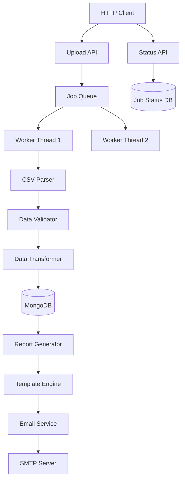

# Advanced Tutorial: Async File Processing Service

## What You'll Build

A production-ready file processing service that:
- Accepts CSV/TSV file uploads via API
- Processes files asynchronously in background
- Validates and transforms data
- Generates HTML/PDF reports using templates
- Sends email notifications when complete
- Tracks job status with real-time updates
- Handles large files with streaming
- Provides progress tracking

**Technologies used:**
- `oap-ws` - File upload API with async endpoints
- `oap-storage` - Job queue and results storage
- `oap-tsv` - CSV/TSV file parsing
- `oap-template` - Report generation
- `oap-mail` - Email notifications
- CompletableFuture - Async processing
- Thread services - Background workers

## Learning Objectives

By completing this tutorial, you'll learn:
- File upload handling in OAP
- Background job processing patterns
- CSV/TSV parsing and validation
- Template-based report generation
- Async API endpoints with CompletableFuture
- Job queue implementation
- Progress tracking and status updates
- Email integration

## Prerequisites

- Completed the [Getting Started Guide](../getting-started.md)
- Java 17+
- Maven 3.6+
- SMTP server (or use Mailtrap/Mailhog for testing)

## Architecture



**Processing Flow:**
1. Client uploads CSV file via POST
2. API creates job and returns job ID immediately
3. File stored temporarily, job queued
4. Background worker picks up job
5. CSV parsed and validated
6. Data transformed and stored
7. HTML report generated from template
8. Email sent with report
9. Job marked complete
10. Client polls status API for updates

## Step 1: Project Setup

**pom.xml:**

```xml
<?xml version="1.0" encoding="UTF-8"?>
<project xmlns="http://maven.apache.org/POM/4.0.0"
         xmlns:xsi="http://www.w3.org/2001/XMLSchema-instance"
         xsi:schemaLocation="http://maven.apache.org/POM/4.0.0
         http://maven.apache.org/xsd/maven-4.0.0.xsd">
    <modelVersion>4.0.0</modelVersion>

    <groupId>com.example</groupId>
    <artifactId>file-processor</artifactId>
    <version>1.0-SNAPSHOT</version>

    <properties>
        <maven.compiler.source>17</maven.compiler.source>
        <maven.compiler.target>17</maven.compiler.target>
        <oap.version>24.3.2</oap.version>
    </properties>

    <repositories>
        <repository>
            <id>oap</id>
            <url>https://artifacts.oaplatform.org/repository/oap-maven/</url>
        </repository>
    </repositories>

    <dependencies>
        <dependency>
            <groupId>oap</groupId>
            <artifactId>oap-application</artifactId>
            <version>${oap.version}</version>
        </dependency>
        <dependency>
            <groupId>oap</groupId>
            <artifactId>oap-ws</artifactId>
            <version>${oap.version}</version>
        </dependency>
        <dependency>
            <groupId>oap</groupId>
            <artifactId>oap-storage</artifactId>
            <version>${oap.version}</version>
        </dependency>
        <dependency>
            <groupId>oap</groupId>
            <artifactId>oap-tsv</artifactId>
            <version>${oap.version}</version>
        </dependency>
        <dependency>
            <groupId>oap</groupId>
            <artifactId>oap-template</artifactId>
            <version>${oap.version}</version>
        </dependency>
        <dependency>
            <groupId>oap</groupId>
            <artifactId>oap-mail</artifactId>
            <version>${oap.version}</version>
        </dependency>
        <dependency>
            <groupId>org.projectlombok</groupId>
            <artifactId>lombok</artifactId>
            <version>1.18.30</version>
            <scope>provided</scope>
        </dependency>
    </dependencies>
</project>
```

## Step 2: Domain Models

**src/main/java/com/example/model/ProcessingJob.java:**

```java
package com.example.model;

import lombok.Data;
import oap.storage.Id;

import java.util.HashMap;
import java.util.Map;

@Data
public class ProcessingJob {
    @Id
    public String id;

    // Job metadata
    public String fileName;
    public String fileType;      // csv, tsv
    public long fileSizeBytes;
    public String uploadedBy;

    // Status
    public Status status = Status.QUEUED;
    public int progress = 0;     // 0-100
    public String statusMessage;

    // Timing
    public long createdAt;
    public long startedAt;
    public long completedAt;

    // Processing stats
    public int totalRows;
    public int validRows;
    public int invalidRows;
    public Map<String, Integer> errorCounts = new HashMap<>();

    // Results
    public String reportUrl;
    public String errorReportUrl;

    // Email
    public String notifyEmail;
    public boolean emailSent;

    public enum Status {
        QUEUED,
        PROCESSING,
        COMPLETED,
        FAILED,
        CANCELLED
    }
}
```

**src/main/java/com/example/model/CustomerRecord.java:**

```java
package com.example.model;

import lombok.Data;
import oap.storage.Id;

@Data
public class CustomerRecord {
    @Id
    public String id;

    // Customer data
    public String email;
    public String firstName;
    public String lastName;
    public String company;
    public String phone;
    public String country;

    // Metadata
    public String jobId;         // Which import job created this
    public long importedAt;
    public boolean valid = true;
    public String validationError;
}
```

**src/main/java/com/example/model/ValidationError.java:**

```java
package com.example.model;

import lombok.AllArgsConstructor;
import lombok.Data;

@Data
@AllArgsConstructor
public class ValidationError {
    public int rowNumber;
    public String field;
    public String value;
    public String error;
}
```

## Step 3: Job Queue

**src/main/java/com/example/queue/JobQueue.java:**

```java
package com.example.queue;

import com.example.model.ProcessingJob;
import lombok.extern.slf4j.Slf4j;

import java.util.Optional;
import java.util.concurrent.BlockingQueue;
import java.util.concurrent.LinkedBlockingQueue;

@Slf4j
public class JobQueue {
    private final BlockingQueue<ProcessingJob> queue;
    private final int maxSize;

    public JobQueue(int maxSize) {
        this.maxSize = maxSize;
        this.queue = new LinkedBlockingQueue<>(maxSize);
    }

    /**
     * Submit job to queue
     */
    public boolean submit(ProcessingJob job) {
        boolean added = queue.offer(job);
        if (added) {
            log.info("Job queued: {} (queue size: {})", job.id, queue.size());
        } else {
            log.warn("Queue full, job rejected: {}", job.id);
        }
        return added;
    }

    /**
     * Take next job (blocking)
     */
    public ProcessingJob take() throws InterruptedException {
        return queue.take();
    }

    /**
     * Peek at next job without removing
     */
    public Optional<ProcessingJob> peek() {
        return Optional.ofNullable(queue.peek());
    }

    /**
     * Get current queue size
     */
    public int size() {
        return queue.size();
    }

    /**
     * Get remaining capacity
     */
    public int remainingCapacity() {
        return queue.remainingCapacity();
    }

    public void start() {
        log.info("Job queue started with capacity {}", maxSize);
    }

    public void stop() {
        log.info("Job queue stopped. {} jobs remaining", queue.size());
    }
}
```

## Step 4: CSV Parser and Validator

**src/main/java/com/example/parser/CustomerCSVParser.java:**

```java
package com.example.parser;

import com.example.model.CustomerRecord;
import com.example.model.ValidationError;
import lombok.extern.slf4j.Slf4j;
import oap.tsv.Tsv;
import oap.tsv.TsvReader;

import java.io.IOException;
import java.nio.file.Path;
import java.util.ArrayList;
import java.util.List;
import java.util.regex.Pattern;

@Slf4j
public class CustomerCSVParser {
    private static final Pattern EMAIL_PATTERN =
        Pattern.compile("^[A-Za-z0-9+_.-]+@[A-Za-z0-9.-]+$");

    private static final Pattern PHONE_PATTERN =
        Pattern.compile("^[+]?[0-9\\s-()]+$");

    /**
     * Parse CSV file and return records with validation
     */
    public ParseResult parse(Path csvFile, String jobId) throws IOException {
        List<CustomerRecord> validRecords = new ArrayList<>();
        List<ValidationError> errors = new ArrayList<>();

        log.info("Parsing CSV file: {}", csvFile);

        int rowNumber = 0;

        try (TsvReader reader = Tsv.tsv.read(csvFile.toFile())) {
            // Assuming CSV has header: email,firstName,lastName,company,phone,country

            for (String[] row : reader) {
                rowNumber++;

                if (row.length < 6) {
                    errors.add(new ValidationError(
                        rowNumber, "row", String.join(",", row),
                        "Insufficient columns (expected 6)"));
                    continue;
                }

                CustomerRecord record = new CustomerRecord();
                record.jobId = jobId;
                record.importedAt = System.currentTimeMillis();

                // Extract fields
                String email = row[0].trim();
                String firstName = row[1].trim();
                String lastName = row[2].trim();
                String company = row[3].trim();
                String phone = row[4].trim();
                String country = row[5].trim();

                // Validate email (required)
                if (email.isEmpty()) {
                    errors.add(new ValidationError(rowNumber, "email", email,
                        "Email is required"));
                    continue;
                } else if (!EMAIL_PATTERN.matcher(email).matches()) {
                    errors.add(new ValidationError(rowNumber, "email", email,
                        "Invalid email format"));
                    continue;
                }

                // Validate first name (required)
                if (firstName.isEmpty()) {
                    errors.add(new ValidationError(rowNumber, "firstName", firstName,
                        "First name is required"));
                    continue;
                }

                // Validate last name (required)
                if (lastName.isEmpty()) {
                    errors.add(new ValidationError(rowNumber, "lastName", lastName,
                        "Last name is required"));
                    continue;
                }

                // Validate phone (optional but must be valid format if present)
                if (!phone.isEmpty() && !PHONE_PATTERN.matcher(phone).matches()) {
                    errors.add(new ValidationError(rowNumber, "phone", phone,
                        "Invalid phone format"));
                    // Don't skip, just note the error
                }

                // Set validated values
                record.email = email;
                record.firstName = firstName;
                record.lastName = lastName;
                record.company = company;
                record.phone = phone;
                record.country = country;
                record.valid = true;

                validRecords.add(record);
            }
        }

        log.info("Parsed {} rows: {} valid, {} errors",
            rowNumber, validRecords.size(), errors.size());

        return new ParseResult(validRecords, errors, rowNumber);
    }

    public static class ParseResult {
        public final List<CustomerRecord> validRecords;
        public final List<ValidationError> errors;
        public final int totalRows;

        public ParseResult(List<CustomerRecord> validRecords,
                          List<ValidationError> errors,
                          int totalRows) {
            this.validRecords = validRecords;
            this.errors = errors;
            this.totalRows = totalRows;
        }
    }
}
```

## Step 5: Report Generator

**src/main/java/com/example/report/ReportGenerator.java:**

```java
package com.example.report;

import com.example.model.ProcessingJob;
import com.example.model.ValidationError;
import lombok.extern.slf4j.Slf4j;
import oap.template.TemplateEngine;

import java.io.IOException;
import java.nio.file.Files;
import java.nio.file.Path;
import java.time.Instant;
import java.time.ZoneOffset;
import java.time.format.DateTimeFormatter;
import java.util.HashMap;
import java.util.List;
import java.util.Map;

@Slf4j
public class ReportGenerator {
    private final TemplateEngine templateEngine;
    private final Path reportsDir;

    public ReportGenerator(TemplateEngine templateEngine, Path reportsDir) {
        this.templateEngine = templateEngine;
        this.reportsDir = reportsDir;
    }

    /**
     * Generate HTML report for completed job
     */
    public String generateReport(ProcessingJob job) throws IOException {
        log.info("Generating report for job: {}", job.id);

        Map<String, Object> context = new HashMap<>();
        context.put("job", job);
        context.put("completedDate", formatTimestamp(job.completedAt));
        context.put("duration", calculateDuration(job));
        context.put("successRate", calculateSuccessRate(job));

        String html = templateEngine.getTemplate("job-report.html")
            .render(context);

        // Save to file
        Path reportFile = reportsDir.resolve(job.id + "-report.html");
        Files.writeString(reportFile, html);

        log.info("Report generated: {}", reportFile);
        return reportFile.toString();
    }

    /**
     * Generate error report if validation errors occurred
     */
    public String generateErrorReport(ProcessingJob job,
                                     List<ValidationError> errors) throws IOException {
        if (errors.isEmpty()) {
            return null;
        }

        log.info("Generating error report for job: {} ({} errors)",
            job.id, errors.size());

        Map<String, Object> context = new HashMap<>();
        context.put("job", job);
        context.put("errors", errors);
        context.put("errorCount", errors.size());

        String html = templateEngine.getTemplate("error-report.html")
            .render(context);

        Path errorFile = reportsDir.resolve(job.id + "-errors.html");
        Files.writeString(errorFile, html);

        log.info("Error report generated: {}", errorFile);
        return errorFile.toString();
    }

    private String formatTimestamp(long timestamp) {
        return Instant.ofEpochMilli(timestamp)
            .atZone(ZoneOffset.UTC)
            .format(DateTimeFormatter.ISO_DATE_TIME);
    }

    private String calculateDuration(ProcessingJob job) {
        if (job.startedAt == 0 || job.completedAt == 0) {
            return "N/A";
        }
        long durationMs = job.completedAt - job.startedAt;
        long seconds = durationMs / 1000;
        long minutes = seconds / 60;
        seconds = seconds % 60;

        if (minutes > 0) {
            return String.format("%dm %ds", minutes, seconds);
        } else {
            return String.format("%ds", seconds);
        }
    }

    private double calculateSuccessRate(ProcessingJob job) {
        if (job.totalRows == 0) {
            return 0.0;
        }
        return (double) job.validRows / job.totalRows * 100.0;
    }

    public void start() throws IOException {
        Files.createDirectories(reportsDir);
        log.info("Report generator started. Reports dir: {}", reportsDir);
    }
}
```

**Create template file: src/main/resources/templates/job-report.html:**

```html
<!DOCTYPE html>
<html>
<head>
    <title>Import Report - ${job.fileName}</title>
    <style>
        body { font-family: Arial, sans-serif; margin: 40px; }
        .header { border-bottom: 2px solid #333; padding-bottom: 20px; }
        .stats { display: grid; grid-template-columns: 1fr 1fr; gap: 20px; margin: 30px 0; }
        .stat-box { border: 1px solid #ddd; padding: 20px; border-radius: 5px; }
        .stat-value { font-size: 32px; font-weight: bold; color: #0066cc; }
        .stat-label { color: #666; margin-top: 5px; }
        .success { color: #28a745; }
        .error { color: #dc3545; }
        table { width: 100%; border-collapse: collapse; margin-top: 20px; }
        th, td { padding: 10px; text-align: left; border-bottom: 1px solid #ddd; }
        th { background-color: #f8f9fa; }
    </style>
</head>
<body>
    <div class="header">
        <h1>Import Report</h1>
        <p><strong>File:</strong> ${job.fileName}</p>
        <p><strong>Job ID:</strong> ${job.id}</p>
        <p><strong>Completed:</strong> ${completedDate}</p>
        <p><strong>Duration:</strong> ${duration}</p>
    </div>

    <div class="stats">
        <div class="stat-box">
            <div class="stat-value">${job.totalRows}</div>
            <div class="stat-label">Total Rows</div>
        </div>
        <div class="stat-box">
            <div class="stat-value success">${job.validRows}</div>
            <div class="stat-label">Valid Records</div>
        </div>
        <div class="stat-box">
            <div class="stat-value error">${job.invalidRows}</div>
            <div class="stat-label">Invalid Records</div>
        </div>
        <div class="stat-box">
            <div class="stat-value">${successRate}%</div>
            <div class="stat-label">Success Rate</div>
        </div>
    </div>

    <h2>Summary</h2>
    <table>
        <tr>
            <th>Metric</th>
            <th>Value</th>
        </tr>
        <tr>
            <td>File Size</td>
            <td>${job.fileSizeBytes} bytes</td>
        </tr>
        <tr>
            <td>Status</td>
            <td>${job.status}</td>
        </tr>
        <tr>
            <td>Email Notification</td>
            <td>${job.emailSent ? "Sent" : "Not sent"}</td>
        </tr>
    </table>

    <p style="margin-top: 40px; color: #666; font-size: 12px;">
        Generated by File Processing Service
    </p>
</body>
</html>
```

## Step 6: Job Processor

**src/main/java/com/example/processor/JobProcessor.java:**

```java
package com.example.processor;

import com.example.model.CustomerRecord;
import com.example.model.ProcessingJob;
import com.example.model.ValidationError;
import com.example.parser.CustomerCSVParser;
import com.example.queue.JobQueue;
import com.example.report.ReportGenerator;
import lombok.extern.slf4j.Slf4j;
import oap.mail.Mailman;
import oap.mail.message.MessageContent;
import oap.storage.MemoryStorage;

import java.nio.file.Path;
import java.nio.file.Paths;
import java.util.List;
import java.util.UUID;

@Slf4j
public class JobProcessor implements Runnable {
    private final JobQueue jobQueue;
    private final MemoryStorage<ProcessingJob> jobStorage;
    private final MemoryStorage<CustomerRecord> customerStorage;
    private final CustomerCSVParser parser;
    private final ReportGenerator reportGenerator;
    private final Mailman mailman;
    private final Path uploadsDir;

    private volatile boolean running = true;

    public JobProcessor(JobQueue jobQueue,
                       MemoryStorage<ProcessingJob> jobStorage,
                       MemoryStorage<CustomerRecord> customerStorage,
                       CustomerCSVParser parser,
                       ReportGenerator reportGenerator,
                       Mailman mailman,
                       Path uploadsDir) {
        this.jobQueue = jobQueue;
        this.jobStorage = jobStorage;
        this.customerStorage = customerStorage;
        this.parser = parser;
        this.reportGenerator = reportGenerator;
        this.mailman = mailman;
        this.uploadsDir = uploadsDir;
    }

    @Override
    public void run() {
        log.info("Job processor started");

        while (running) {
            try {
                // Wait for next job
                ProcessingJob job = jobQueue.take();
                processJob(job);

            } catch (InterruptedException e) {
                Thread.currentThread().interrupt();
                log.info("Job processor interrupted");
                break;
            } catch (Exception e) {
                log.error("Error processing job", e);
            }
        }

        log.info("Job processor stopped");
    }

    /**
     * Process a single job
     */
    private void processJob(ProcessingJob job) {
        log.info("Processing job: {}", job.id);

        try {
            // Update status
            job.status = ProcessingJob.Status.PROCESSING;
            job.startedAt = System.currentTimeMillis();
            job.progress = 10;
            jobStorage.store(job);

            // Parse file
            Path csvFile = uploadsDir.resolve(job.fileName);
            CustomerCSVParser.ParseResult result = parser.parse(csvFile, job.id);

            job.progress = 40;
            job.totalRows = result.totalRows;
            job.validRows = result.validRecords.size();
            job.invalidRows = result.errors.size();
            jobStorage.store(job);

            // Store valid records
            log.info("Storing {} valid records", result.validRecords.size());
            for (CustomerRecord record : result.validRecords) {
                record.id = UUID.randomUUID().toString();
                customerStorage.store(record);
            }

            job.progress = 70;
            jobStorage.store(job);

            // Generate reports
            String reportPath = reportGenerator.generateReport(job);
            job.reportUrl = reportPath;

            if (!result.errors.isEmpty()) {
                String errorReportPath = reportGenerator.generateErrorReport(job, result.errors);
                job.errorReportUrl = errorReportPath;
            }

            job.progress = 90;
            jobStorage.store(job);

            // Send email notification
            if (job.notifyEmail != null && !job.notifyEmail.isEmpty()) {
                sendNotification(job);
                job.emailSent = true;
            }

            // Mark complete
            job.status = ProcessingJob.Status.COMPLETED;
            job.completedAt = System.currentTimeMillis();
            job.progress = 100;
            job.statusMessage = "Processing completed successfully";
            jobStorage.store(job);

            log.info("Job completed: {} ({} valid, {} errors)",
                job.id, job.validRows, job.invalidRows);

        } catch (Exception e) {
            log.error("Job failed: {}", job.id, e);
            job.status = ProcessingJob.Status.FAILED;
            job.statusMessage = "Error: " + e.getMessage();
            job.completedAt = System.currentTimeMillis();
            jobStorage.store(job);
        }
    }

    /**
     * Send email notification
     */
    private void sendNotification(ProcessingJob job) {
        try {
            String subject = String.format("Import Complete: %s", job.fileName);

            String body = String.format("""
                Your file import has completed.

                File: %s
                Total Rows: %d
                Valid Records: %d
                Invalid Records: %d

                Job ID: %s
                Status: %s

                View full report at: %s
                """,
                job.fileName,
                job.totalRows,
                job.validRows,
                job.invalidRows,
                job.id,
                job.status,
                job.reportUrl
            );

            MessageContent message = MessageContent.builder()
                .subject(subject)
                .textBody(body)
                .build();

            mailman.send(job.notifyEmail, message);

            log.info("Notification sent to: {}", job.notifyEmail);

        } catch (Exception e) {
            log.error("Failed to send notification", e);
        }
    }

    public void preStop() {
        running = false;
    }
}
```

## Step 7: Upload API

**src/main/java/com/example/api/UploadAPI.java:**

```java
package com.example.api;

import com.example.model.ProcessingJob;
import com.example.queue.JobQueue;
import io.undertow.server.HttpServerExchange;
import io.undertow.server.handlers.form.FormData;
import io.undertow.server.handlers.form.FormDataParser;
import lombok.Data;
import lombok.extern.slf4j.Slf4j;
import oap.http.Http;
import oap.storage.MemoryStorage;
import oap.ws.Response;
import oap.ws.WsMethod;
import oap.ws.WsParam;

import java.io.IOException;
import java.nio.file.Files;
import java.nio.file.Path;
import java.nio.file.StandardCopyOption;
import java.util.UUID;
import java.util.concurrent.CompletableFuture;

import static oap.ws.WsParam.From.QUERY;

@Slf4j
public class UploadAPI {
    private final JobQueue jobQueue;
    private final MemoryStorage<ProcessingJob> jobStorage;
    private final Path uploadsDir;
    private final FormDataParser formDataParser;

    public UploadAPI(JobQueue jobQueue,
                     MemoryStorage<ProcessingJob> jobStorage,
                     Path uploadsDir,
                     FormDataParser formDataParser) {
        this.jobQueue = jobQueue;
        this.jobStorage = jobStorage;
        this.uploadsDir = uploadsDir;
        this.formDataParser = formDataParser;
    }

    /**
     * Upload file and start processing (async)
     */
    @WsMethod(path = "/api/upload", method = "POST")
    public CompletableFuture<Response> uploadFile(
            HttpServerExchange exchange,
            @WsParam(from = QUERY) String email) {

        return CompletableFuture.supplyAsync(() -> {
            try {
                // Parse multipart form data
                FormData formData = formDataParser.parseBlocking(exchange);
                FormData.FormValue fileValue = formData.getFirst("file");

                if (fileValue == null || !fileValue.isFileItem()) {
                    return Response.status(Http.StatusCode.BAD_REQUEST)
                        .response("No file uploaded");
                }

                // Get file info
                String originalFileName = fileValue.getFileName();
                Path tempFile = fileValue.getFileItem().getFile();
                long fileSize = Files.size(tempFile);

                log.info("File uploaded: {} ({} bytes)", originalFileName, fileSize);

                // Create job
                ProcessingJob job = new ProcessingJob();
                job.id = UUID.randomUUID().toString();
                job.fileName = job.id + "-" + originalFileName;
                job.fileType = getFileType(originalFileName);
                job.fileSizeBytes = fileSize;
                job.notifyEmail = email;
                job.createdAt = System.currentTimeMillis();
                job.status = ProcessingJob.Status.QUEUED;

                // Save file
                Path savedFile = uploadsDir.resolve(job.fileName);
                Files.copy(tempFile, savedFile, StandardCopyOption.REPLACE_EXISTING);

                // Store job
                jobStorage.store(job);

                // Queue for processing
                boolean queued = jobQueue.submit(job);

                if (!queued) {
                    job.status = ProcessingJob.Status.FAILED;
                    job.statusMessage = "Queue full, try again later";
                    jobStorage.store(job);

                    return Response.status(Http.StatusCode.SERVICE_UNAVAILABLE)
                        .response(new UploadResponse(job.id, job.status.toString(),
                            "Queue full"));
                }

                log.info("Job created and queued: {}", job.id);

                return Response.status(Http.StatusCode.ACCEPTED)
                    .response(new UploadResponse(job.id, job.status.toString(),
                        "File uploaded and queued for processing"));

            } catch (IOException e) {
                log.error("Upload failed", e);
                return Response.status(Http.StatusCode.INTERNAL_SERVER_ERROR)
                    .response("Upload failed: " + e.getMessage());
            }
        });
    }

    private String getFileType(String fileName) {
        if (fileName.endsWith(".csv")) return "csv";
        if (fileName.endsWith(".tsv")) return "tsv";
        return "unknown";
    }

    @Data
    public static class UploadResponse {
        public String jobId;
        public String status;
        public String message;

        public UploadResponse(String jobId, String status, String message) {
            this.jobId = jobId;
            this.status = status;
            this.message = message;
        }
    }
}
```

## Step 8: Status API

**src/main/java/com/example/api/JobStatusAPI.java:**

```java
package com.example.api;

import com.example.model.ProcessingJob;
import lombok.Data;
import oap.http.Http;
import oap.storage.MemoryStorage;
import oap.ws.Response;
import oap.ws.WsMethod;
import oap.ws.WsParam;

import java.util.List;
import java.util.Optional;

import static oap.ws.WsParam.From.PATH;
import static oap.ws.WsParam.From.QUERY;

public class JobStatusAPI {
    private final MemoryStorage<ProcessingJob> jobStorage;

    public JobStatusAPI(MemoryStorage<ProcessingJob> jobStorage) {
        this.jobStorage = jobStorage;
    }

    @WsMethod(path = "/api/jobs/{id}", method = "GET")
    public Response getJobStatus(@WsParam(from = PATH) String id) {
        Optional<ProcessingJob> job = jobStorage.get(id);

        if (job.isEmpty()) {
            return Response.status(Http.StatusCode.NOT_FOUND)
                .response("Job not found");
        }

        return Response.ok(toStatusResponse(job.get()));
    }

    @WsMethod(path = "/api/jobs", method = "GET")
    public List<JobStatusResponse> listJobs(
            @WsParam(from = QUERY) Optional<String> status) {

        return jobStorage.list().stream()
            .filter(job -> status.isEmpty() ||
                job.status.toString().equalsIgnoreCase(status.get()))
            .map(this::toStatusResponse)
            .toList();
    }

    @WsMethod(path = "/api/jobs/{id}/cancel", method = "POST")
    public Response cancelJob(@WsParam(from = PATH) String id) {
        Optional<ProcessingJob> jobOpt = jobStorage.get(id);

        if (jobOpt.isEmpty()) {
            return Response.status(Http.StatusCode.NOT_FOUND)
                .response("Job not found");
        }

        ProcessingJob job = jobOpt.get();

        if (job.status == ProcessingJob.Status.COMPLETED ||
            job.status == ProcessingJob.Status.FAILED) {
            return Response.status(Http.StatusCode.BAD_REQUEST)
                .response("Job already finished");
        }

        job.status = ProcessingJob.Status.CANCELLED;
        job.statusMessage = "Cancelled by user";
        jobStorage.store(job);

        return Response.ok("Job cancelled");
    }

    private JobStatusResponse toStatusResponse(ProcessingJob job) {
        JobStatusResponse response = new JobStatusResponse();
        response.jobId = job.id;
        response.fileName = job.fileName;
        response.status = job.status.toString();
        response.progress = job.progress;
        response.statusMessage = job.statusMessage;
        response.totalRows = job.totalRows;
        response.validRows = job.validRows;
        response.invalidRows = job.invalidRows;
        response.reportUrl = job.reportUrl;
        response.createdAt = job.createdAt;
        response.completedAt = job.completedAt;
        return response;
    }

    @Data
    public static class JobStatusResponse {
        public String jobId;
        public String fileName;
        public String status;
        public int progress;
        public String statusMessage;
        public int totalRows;
        public int validRows;
        public int invalidRows;
        public String reportUrl;
        public long createdAt;
        public long completedAt;
    }
}
```

## Step 9: Module Configuration

**src/main/resources/META-INF/oap-module.conf:**

```hocon
name = file-processor

services {
    # Job queue
    job-queue {
        implementation = com.example.queue.JobQueue
        parameters {
            maxSize = 100
        }
        supervision.supervise = true
    }

    # Storage
    job-storage {
        implementation = oap.storage.MemoryStorage
        parameters {
            fsDirectory = "./data/jobs"
            lock = SERIALIZED
        }
        supervision.supervise = true
    }

    customer-storage {
        implementation = oap.storage.MemoryStorage
        parameters {
            fsDirectory = "./data/customers"
            lock = SERIALIZED
        }
        supervision.supervise = true
    }

    # Parser
    csv-parser {
        implementation = com.example.parser.CustomerCSVParser
    }

    # Template engine
    template-engine {
        implementation = oap.template.TemplateEngine
        parameters {
            templatesPath = "templates"
        }
    }

    # Report generator
    report-generator {
        implementation = com.example.report.ReportGenerator
        parameters {
            templateEngine = <modules.this.template-engine>
            reportsDir = "./data/reports"
        }
        supervision.supervise = true
    }

    # Mail
    mailman {
        implementation = oap.mail.Mailman
        parameters {
            transport = <modules.oap-mail.oap-mail-transport-smtp>
            queue = <modules.oap-mail.oap-mail-queue>
            retryPeriod = 1m
        }
        supervision {
            supervise = true
            thread = true
        }
    }

    # Job processor (background thread)
    job-processor {
        implementation = com.example.processor.JobProcessor
        parameters {
            jobQueue = <modules.this.job-queue>
            jobStorage = <modules.this.job-storage>
            customerStorage = <modules.this.customer-storage>
            parser = <modules.this.csv-parser>
            reportGenerator = <modules.this.report-generator>
            mailman = <modules.this.mailman>
            uploadsDir = "./data/uploads"
        }
        supervision {
            supervise = true
            thread = true
        }
    }

    # Form data parser for file uploads
    form-data-parser {
        implementation = io.undertow.server.handlers.form.FormParserFactory
    }

    # APIs
    upload-api {
        implementation = com.example.api.UploadAPI
        parameters {
            jobQueue = <modules.this.job-queue>
            jobStorage = <modules.this.job-storage>
            uploadsDir = "./data/uploads"
            formDataParser = <modules.this.form-data-parser>
        }
    }

    status-api {
        implementation = com.example.api.JobStatusAPI
        parameters {
            jobStorage = <modules.this.job-storage>
        }
    }

    # Web services
    web-services {
        implementation = oap.ws.WebServices
        parameters {
            services = [
                <modules.this.upload-api>
                <modules.this.status-api>
            ]
        }
    }
}
```

## Step 10: Application Configuration

**application.conf:**

```hocon
boot.main = [
    oap-http
    oap-ws
    oap-mail
    file-processor
]

services {
    oap-http.oap-http-server.parameters {
        defaultPort.httpPort = 8080
        maxEntitySize = 104857600  # 100MB for file uploads
    }

    oap-mail {
        oap-mail-transport-smtp.parameters {
            host = "localhost"
            host = ${?SMTP_HOST}
            port = 1025
            port = ${?SMTP_PORT}
            username = ${?SMTP_USERNAME}
            password = ${?SMTP_PASSWORD}
        }

        oap-mail-queue.parameters {
            location = "./data/mail-queue"
        }
    }
}
```

## Step 11: Test the Service

**1. Start a test SMTP server (Mailhog):**

```bash
docker run -d -p 1025:1025 -p 8025:8025 mailhog/mailhog
```

**2. Create test CSV file (test-customers.csv):**

```csv
email,firstName,lastName,company,phone,country
john@example.com,John,Doe,Acme Corp,+1-555-0100,USA
jane@example.com,Jane,Smith,Tech Inc,+1-555-0200,USA
invalid-email,Bob,Jones,Company,555-0300,USA
alice@example.com,Alice,Williams,StartupCo,+1-555-0400,UK
,Missing,Email,NoEmail Inc,555-0500,USA
```

**3. Upload file:**

```bash
curl -X POST http://localhost:8080/api/upload?email=you@example.com \
  -F "file=@test-customers.csv"
```

Response:
```json
{
  "jobId": "abc-123-def",
  "status": "QUEUED",
  "message": "File uploaded and queued for processing"
}
```

**4. Check job status:**

```bash
curl http://localhost:8080/api/jobs/abc-123-def
```

**5. Poll for completion:**

```bash
#!/bin/bash
JOB_ID="abc-123-def"

while true; do
  STATUS=$(curl -s http://localhost:8080/api/jobs/$JOB_ID | jq -r '.status')
  PROGRESS=$(curl -s http://localhost:8080/api/jobs/$JOB_ID | jq -r '.progress')

  echo "Status: $STATUS, Progress: $PROGRESS%"

  if [ "$STATUS" = "COMPLETED" ] || [ "$STATUS" = "FAILED" ]; then
    break
  fi

  sleep 2
done

echo "Job finished!"
curl http://localhost:8080/api/jobs/$JOB_ID | jq .
```

**6. List all jobs:**

```bash
curl http://localhost:8080/api/jobs
```

**7. Check email:**

Open http://localhost:8025 to see the notification email.

## Production Enhancements

### 1. Progress Updates

Emit progress during parsing:

```java
private void updateProgress(ProcessingJob job, int progress, String message) {
    job.progress = progress;
    job.statusMessage = message;
    jobStorage.store(job);

    // Optionally emit to WebSocket for real-time updates
    progressEmitter.emit(job.id, progress, message);
}
```

### 2. File Size Limits

```java
if (fileSize > maxFileSizeBytes) {
    return Response.status(Http.StatusCode.REQUEST_ENTITY_TOO_LARGE)
        .response("File too large. Max size: " + maxFileSizeBytes);
}
```

### 3. Multiple Workers

```hocon
job-processor-1 {
    implementation = com.example.processor.JobProcessor
    # ... config
    supervision.thread = true
}
job-processor-2 {
    implementation = com.example.processor.JobProcessor
    # ... config
    supervision.thread = true
}
```

### 4. Retry Failed Jobs

```java
@WsMethod(path = "/api/jobs/{id}/retry", method = "POST")
public Response retryJob(@WsParam(from = PATH) String id) {
    ProcessingJob job = jobStorage.get(id).orElseThrow();

    if (job.status != ProcessingJob.Status.FAILED) {
        return Response.badRequest("Only failed jobs can be retried");
    }

    job.status = ProcessingJob.Status.QUEUED;
    job.progress = 0;
    jobStorage.store(job);
    jobQueue.submit(job);

    return Response.ok("Job requeued");
}
```

### 5. Streaming Large Files

For very large files, use streaming parser:

```java
try (Stream<String[]> lines = Tsv.tsv.stream(csvFile)) {
    lines.forEach(row -> {
        // Process row
        processedCount++;
        if (processedCount % 1000 == 0) {
            updateProgress(job, calculateProgress(processedCount),
                "Processed " + processedCount + " rows");
        }
    });
}
```

## What You've Learned

✅ **File uploads** - Multipart form data handling
✅ **Async processing** - CompletableFuture for non-blocking APIs
✅ **Job queues** - Background task processing
✅ **CSV parsing** - Data validation and transformation
✅ **Template engine** - HTML report generation
✅ **Email integration** - Notifications with oap-mail
✅ **Progress tracking** - Real-time status updates
✅ **Error handling** - Validation errors and reports
✅ **Thread services** - Background workers

## Next Steps

- Add WebSocket for real-time progress
- Implement job scheduling (recurring imports)
- Add data transformation rules
- Support more file formats (Excel, JSON)
- Add job priority queue
- Implement job expiration/cleanup
- Add user authentication
- Create admin dashboard

## See Also

- [OAP TSV Documentation](../../oap-formats/oap-tsv/README.md)
- [OAP Template](../../oap-formats/oap-template/README.md)
- [OAP Mail](../../oap-mail/README.md)
- [OAP Storage](../../oap-storage/README.md)
- [Developer Guide](../developer-guide.md)
