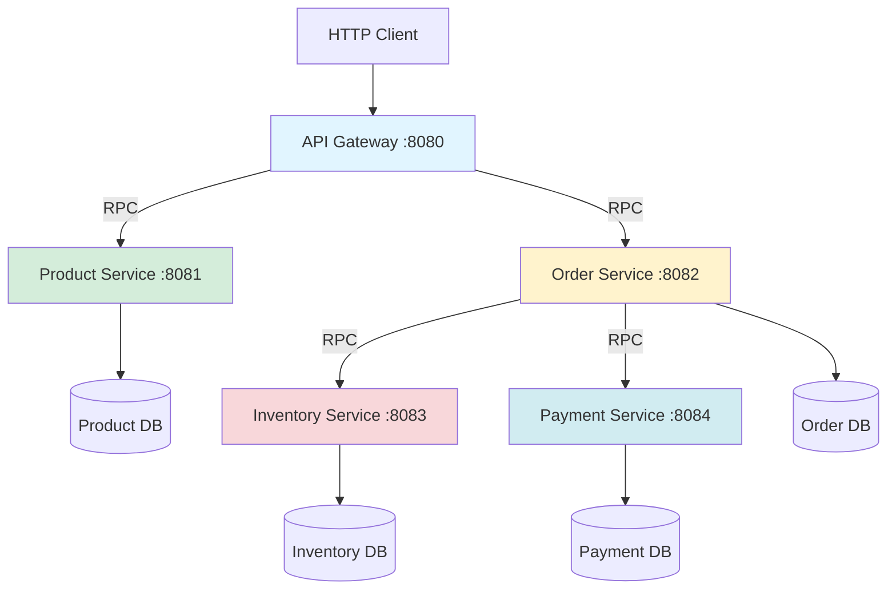

# Advanced Tutorial: Distributed Microservices

## What You'll Build

A distributed e-commerce system with multiple microservices communicating via RPC:
- **API Gateway** - Frontend service routing requests
- **Product Service** - Product catalog management
- **Inventory Service** - Stock level tracking
- **Order Service** - Order processing
- **Payment Service** - Payment processing
- Service-to-service communication using oap-remote
- Health monitoring across services
- Distributed data consistency

**Technologies used:**
- `oap-remote` - RPC between services
- `oap-ws` - External HTTP APIs
- `oap-storage` - Service data persistence
- `oap-http` - HTTP servers for each service
- Service discovery - Manual configuration
- Health checks - Cross-service monitoring

## Learning Objectives

By completing this tutorial, you'll learn:
- Microservices architecture patterns
- RPC communication with oap-remote
- Service-to-service calls
- Distributed transactions (saga pattern)
- Service health monitoring
- API Gateway pattern
- Service isolation and fault tolerance
- Cross-service data consistency

## Prerequisites

- Completed the [Getting Started Guide](../getting-started.md)
- Java 17+
- Maven 3.6+
- Understanding of microservices concepts

## Architecture



**Service Communication:**
- Gateway → Products: Get product details
- Gateway → Orders: Create order
- Orders → Inventory: Reserve stock
- Orders → Payment: Process payment
- All services expose health endpoints

## Project Structure

We'll create a multi-module Maven project:

```
ecommerce/
├── pom.xml (parent)
├── common/
│   └── src/main/java/com/example/common/
├── product-service/
│   └── src/main/java/com/example/product/
├── inventory-service/
│   └── src/main/java/com/example/inventory/
├── payment-service/
│   └── src/main/java/com/example/payment/
├── order-service/
│   └── src/main/java/com/example/order/
└── api-gateway/
    └── src/main/java/com/example/gateway/
```

## Step 1: Parent POM

**pom.xml:**

```xml
<?xml version="1.0" encoding="UTF-8"?>
<project xmlns="http://maven.apache.org/POM/4.0.0"
         xmlns:xsi="http://www.w3.org/2001/XMLSchema-instance"
         xsi:schemaLocation="http://maven.apache.org/POM/4.0.0
         http://maven.apache.org/xsd/maven-4.0.0.xsd">
    <modelVersion>4.0.0</modelVersion>

    <groupId>com.example</groupId>
    <artifactId>ecommerce-parent</artifactId>
    <version>1.0-SNAPSHOT</version>
    <packaging>pom</packaging>

    <modules>
        <module>common</module>
        <module>product-service</module>
        <module>inventory-service</module>
        <module>payment-service</module>
        <module>order-service</module>
        <module>api-gateway</module>
    </modules>

    <properties>
        <maven.compiler.source>17</maven.compiler.source>
        <maven.compiler.target>17</maven.compiler.target>
        <oap.version>24.3.2</oap.version>
    </properties>

    <repositories>
        <repository>
            <id>oap</id>
            <url>https://artifacts.oaplatform.org/repository/oap-maven/</url>
        </repository>
    </repositories>

    <dependencyManagement>
        <dependencies>
            <dependency>
                <groupId>oap</groupId>
                <artifactId>oap-application</artifactId>
                <version>${oap.version}</version>
            </dependency>
            <dependency>
                <groupId>oap</groupId>
                <artifactId>oap-ws</artifactId>
                <version>${oap.version}</version>
            </dependency>
            <dependency>
                <groupId>oap</groupId>
                <artifactId>oap-remote</artifactId>
                <version>${oap.version}</version>
            </dependency>
            <dependency>
                <groupId>oap</groupId>
                <artifactId>oap-storage</artifactId>
                <version>${oap.version}</version>
            </dependency>
            <dependency>
                <groupId>org.projectlombok</groupId>
                <artifactId>lombok</artifactId>
                <version>1.18.30</version>
                <scope>provided</scope>
            </dependency>
        </dependencies>
    </dependencyManagement>
</project>
```

## Step 2: Common Module (Shared Models)

**common/src/main/java/com/example/common/Product.java:**

```java
package com.example.common;

import lombok.Data;
import oap.storage.Id;

import java.math.BigDecimal;

@Data
public class Product {
    @Id
    public String id;
    public String name;
    public String description;
    public BigDecimal price;
    public String category;
    public boolean available = true;
}
```

**common/src/main/java/com/example/common/Order.java:**

```java
package com.example.common;

import lombok.Data;
import oap.storage.Id;

import java.math.BigDecimal;
import java.util.ArrayList;
import java.util.List;

@Data
public class Order {
    @Id
    public String id;
    public String customerId;
    public List<OrderItem> items = new ArrayList<>();
    public BigDecimal totalAmount;
    public Status status = Status.PENDING;
    public long createdAt;

    public enum Status {
        PENDING,
        CONFIRMED,
        PAYMENT_PROCESSING,
        PAID,
        SHIPPED,
        DELIVERED,
        CANCELLED,
        FAILED
    }
}
```

**common/src/main/java/com/example/common/OrderItem.java:**

```java
package com.example.common;

import lombok.AllArgsConstructor;
import lombok.Data;
import lombok.NoArgsConstructor;

import java.math.BigDecimal;

@Data
@NoArgsConstructor
@AllArgsConstructor
public class OrderItem {
    public String productId;
    public int quantity;
    public BigDecimal price;
}
```

**common/src/main/java/com/example/common/StockLevel.java:**

```java
package com.example.common;

import lombok.Data;
import oap.storage.Id;

@Data
public class StockLevel {
    @Id
    public String productId;
    public int available;
    public int reserved;
    public int sold;
}
```

## Step 3: Product Service

**product-service/src/main/java/com/example/product/ProductService.java:**

```java
package com.example.product;

import com.example.common.Product;
import lombok.extern.slf4j.Slf4j;
import oap.storage.MemoryStorage;

import java.util.List;
import java.util.Optional;

@Slf4j
public class ProductService {
    private final MemoryStorage<Product> storage;

    public ProductService(MemoryStorage<Product> storage) {
        this.storage = storage;
    }

    /**
     * Get product by ID (called via RPC from gateway)
     */
    public Optional<Product> getProduct(String id) {
        log.debug("Getting product: {}", id);
        return storage.get(id);
    }

    /**
     * List all products (called via RPC from gateway)
     */
    public List<Product> listProducts() {
        log.debug("Listing all products");
        return storage.list();
    }

    /**
     * Search products by name
     */
    public List<Product> searchProducts(String query) {
        log.debug("Searching products: {}", query);
        return storage.list().stream()
            .filter(p -> p.name.toLowerCase().contains(query.toLowerCase()))
            .toList();
    }

    /**
     * Create product (internal API)
     */
    public Product createProduct(Product product) {
        storage.store(product);
        log.info("Product created: {}", product.id);
        return product;
    }

    public void start() {
        log.info("Product service started");
    }
}
```

**product-service/src/main/resources/META-INF/oap-module.conf:**

```hocon
name = product-service

services {
    product-storage {
        implementation = oap.storage.MemoryStorage
        parameters {
            fsDirectory = "./data/products"
            lock = SERIALIZED
        }
        supervision.supervise = true
    }

    product-service {
        implementation = com.example.product.ProductService
        parameters {
            storage = <modules.this.product-storage>
        }
        supervision.supervise = true
    }

    # Expose service via oap-remote
    remote-product-service {
        implementation = oap.remote.RemoteService
        parameters {
            service = <modules.this.product-service>
            name = "product-service"
        }
    }
}
```

**product-service/application.conf:**

```hocon
boot.main = [
    oap-http
    oap-remote
    product-service
]

services {
    oap-http.oap-http-server.parameters {
        defaultPort.httpPort = 8081
    }

    oap-remote.oap-remote-server.parameters {
        port = 9081
    }
}
```

## Step 4: Inventory Service

**inventory-service/src/main/java/com/example/inventory/InventoryService.java:**

```java
package com.example.inventory;

import com.example.common.StockLevel;
import lombok.extern.slf4j.Slf4j;
import oap.storage.MemoryStorage;
import oap.util.Result;

import java.util.Optional;

@Slf4j
public class InventoryService {
    private final MemoryStorage<StockLevel> storage;

    public InventoryService(MemoryStorage<StockLevel> storage) {
        this.storage = storage;
    }

    /**
     * Check if product is in stock
     */
    public boolean isInStock(String productId, int quantity) {
        Optional<StockLevel> stockOpt = storage.get(productId);
        if (stockOpt.isEmpty()) {
            return false;
        }
        StockLevel stock = stockOpt.get();
        return stock.available >= quantity;
    }

    /**
     * Reserve stock for order (called via RPC from order service)
     */
    public Result<Void, String> reserveStock(String productId, int quantity) {
        log.info("Reserving {} units of product {}", quantity, productId);

        Optional<StockLevel> stockOpt = storage.get(productId);
        if (stockOpt.isEmpty()) {
            return Result.failure("Product not found in inventory");
        }

        StockLevel stock = stockOpt.get();

        if (stock.available < quantity) {
            return Result.failure(
                String.format("Insufficient stock: %d available, %d requested",
                    stock.available, quantity));
        }

        // Reserve stock
        stock.available -= quantity;
        stock.reserved += quantity;
        storage.store(stock);

        log.info("Stock reserved: {} units of product {}", quantity, productId);
        return Result.success(null);
    }

    /**
     * Commit reserved stock (convert to sold)
     */
    public void commitReservation(String productId, int quantity) {
        log.info("Committing reservation: {} units of product {}",
            quantity, productId);

        storage.get(productId).ifPresent(stock -> {
            stock.reserved -= quantity;
            stock.sold += quantity;
            storage.store(stock);
        });
    }

    /**
     * Release reserved stock (rollback)
     */
    public void releaseReservation(String productId, int quantity) {
        log.info("Releasing reservation: {} units of product {}",
            quantity, productId);

        storage.get(productId).ifPresent(stock -> {
            stock.reserved -= quantity;
            stock.available += quantity;
            storage.store(stock);
        });
    }

    /**
     * Initialize stock for product
     */
    public void initializeStock(String productId, int initialQuantity) {
        StockLevel stock = new StockLevel();
        stock.productId = productId;
        stock.available = initialQuantity;
        stock.reserved = 0;
        stock.sold = 0;
        storage.store(stock);
        log.info("Stock initialized: {} units of product {}",
            initialQuantity, productId);
    }

    public void start() {
        log.info("Inventory service started");
    }
}
```

**inventory-service/src/main/resources/META-INF/oap-module.conf:**

```hocon
name = inventory-service

services {
    inventory-storage {
        implementation = oap.storage.MemoryStorage
        parameters {
            fsDirectory = "./data/inventory"
            lock = SERIALIZED
        }
        supervision.supervise = true
    }

    inventory-service {
        implementation = com.example.inventory.InventoryService
        parameters {
            storage = <modules.this.inventory-storage>
        }
        supervision.supervise = true
    }

    remote-inventory-service {
        implementation = oap.remote.RemoteService
        parameters {
            service = <modules.this.inventory-service>
            name = "inventory-service"
        }
    }
}
```

**inventory-service/application.conf:**

```hocon
boot.main = [
    oap-http
    oap-remote
    inventory-service
]

services {
    oap-http.oap-http-server.parameters {
        defaultPort.httpPort = 8083
    }

    oap-remote.oap-remote-server.parameters {
        port = 9083
    }
}
```

## Step 5: Payment Service

**payment-service/src/main/java/com/example/payment/PaymentService.java:**

```java
package com.example.payment;

import lombok.Data;
import lombok.extern.slf4j.Slf4j;
import oap.util.Result;

import java.math.BigDecimal;
import java.util.UUID;

@Slf4j
public class PaymentService {

    /**
     * Process payment (called via RPC from order service)
     */
    public Result<PaymentResult, String> processPayment(
            String orderId,
            String customerId,
            BigDecimal amount) {

        log.info("Processing payment for order {} amount {}",
            orderId, amount);

        // Simulate payment processing
        try {
            Thread.sleep(1000); // Simulate external payment gateway call

            // Simulate 95% success rate
            boolean success = Math.random() < 0.95;

            if (success) {
                PaymentResult result = new PaymentResult();
                result.transactionId = UUID.randomUUID().toString();
                result.orderId = orderId;
                result.amount = amount;
                result.status = "SUCCESS";

                log.info("Payment successful: transaction {}",
                    result.transactionId);
                return Result.success(result);
            } else {
                log.warn("Payment failed for order {}", orderId);
                return Result.failure("Payment declined by processor");
            }

        } catch (InterruptedException e) {
            Thread.currentThread().interrupt();
            return Result.failure("Payment processing interrupted");
        }
    }

    /**
     * Refund payment (for order cancellation)
     */
    public Result<Void, String> refundPayment(String transactionId) {
        log.info("Processing refund for transaction {}", transactionId);

        // Simulate refund processing
        try {
            Thread.sleep(500);
            log.info("Refund processed: {}", transactionId);
            return Result.success(null);
        } catch (InterruptedException e) {
            Thread.currentThread().interrupt();
            return Result.failure("Refund processing interrupted");
        }
    }

    public void start() {
        log.info("Payment service started");
    }

    @Data
    public static class PaymentResult {
        public String transactionId;
        public String orderId;
        public BigDecimal amount;
        public String status;
    }
}
```

**payment-service/src/main/resources/META-INF/oap-module.conf:**

```hocon
name = payment-service

services {
    payment-service {
        implementation = com.example.payment.PaymentService
        supervision.supervise = true
    }

    remote-payment-service {
        implementation = oap.remote.RemoteService
        parameters {
            service = <modules.this.payment-service>
            name = "payment-service"
        }
    }
}
```

**payment-service/application.conf:**

```hocon
boot.main = [
    oap-http
    oap-remote
    payment-service
]

services {
    oap-http.oap-http-server.parameters {
        defaultPort.httpPort = 8084
    }

    oap-remote.oap-remote-server.parameters {
        port = 9084
    }
}
```

## Step 6: Order Service (Orchestrator)

**order-service/src/main/java/com/example/order/OrderService.java:**

```java
package com.example.order;

import com.example.common.Order;
import com.example.common.OrderItem;
import com.example.inventory.InventoryService;
import com.example.payment.PaymentService;
import lombok.extern.slf4j.Slf4j;
import oap.storage.MemoryStorage;
import oap.util.Result;

import java.math.BigDecimal;
import java.util.List;
import java.util.UUID;

@Slf4j
public class OrderService {
    private final MemoryStorage<Order> storage;
    private final InventoryService inventoryService;  // Remote
    private final PaymentService paymentService;      // Remote

    public OrderService(MemoryStorage<Order> storage,
                       InventoryService inventoryService,
                       PaymentService paymentService) {
        this.storage = storage;
        this.inventoryService = inventoryService;
        this.paymentService = paymentService;
    }

    /**
     * Create order with distributed transaction (Saga pattern)
     */
    public Result<Order, String> createOrder(
            String customerId,
            List<OrderItem> items) {

        log.info("Creating order for customer {} with {} items",
            customerId, items.size());

        // Create order
        Order order = new Order();
        order.id = UUID.randomUUID().toString();
        order.customerId = customerId;
        order.items = items;
        order.totalAmount = calculateTotal(items);
        order.status = Order.Status.PENDING;
        order.createdAt = System.currentTimeMillis();

        storage.store(order);

        try {
            // Step 1: Reserve inventory (compensatable)
            for (OrderItem item : items) {
                Result<Void, String> reserveResult =
                    inventoryService.reserveStock(item.productId, item.quantity);

                if (!reserveResult.isSuccess()) {
                    // Rollback: release previously reserved items
                    rollbackInventoryReservations(order);
                    order.status = Order.Status.FAILED;
                    storage.store(order);
                    return Result.failure("Failed to reserve inventory: " +
                        reserveResult.failureValue());
                }
            }

            order.status = Order.Status.CONFIRMED;
            storage.store(order);

            // Step 2: Process payment (compensatable)
            order.status = Order.Status.PAYMENT_PROCESSING;
            storage.store(order);

            Result<PaymentService.PaymentResult, String> paymentResult =
                paymentService.processPayment(
                    order.id,
                    order.customerId,
                    order.totalAmount);

            if (!paymentResult.isSuccess()) {
                // Rollback: release inventory
                rollbackInventoryReservations(order);
                order.status = Order.Status.FAILED;
                storage.store(order);
                return Result.failure("Payment failed: " +
                    paymentResult.failureValue());
            }

            // Step 3: Commit inventory (non-compensatable)
            for (OrderItem item : items) {
                inventoryService.commitReservation(
                    item.productId, item.quantity);
            }

            // Order complete
            order.status = Order.Status.PAID;
            storage.store(order);

            log.info("Order created successfully: {}", order.id);
            return Result.success(order);

        } catch (Exception e) {
            log.error("Order creation failed: {}", order.id, e);
            rollbackInventoryReservations(order);
            order.status = Order.Status.FAILED;
            storage.store(order);
            return Result.failure("Order processing error: " + e.getMessage());
        }
    }

    /**
     * Rollback inventory reservations (compensation)
     */
    private void rollbackInventoryReservations(Order order) {
        log.warn("Rolling back inventory reservations for order {}", order.id);
        for (OrderItem item : order.items) {
            try {
                inventoryService.releaseReservation(
                    item.productId, item.quantity);
            } catch (Exception e) {
                log.error("Failed to rollback inventory for product {}",
                    item.productId, e);
            }
        }
    }

    private BigDecimal calculateTotal(List<OrderItem> items) {
        return items.stream()
            .map(item -> item.price.multiply(BigDecimal.valueOf(item.quantity)))
            .reduce(BigDecimal.ZERO, BigDecimal::add);
    }

    public void start() {
        log.info("Order service started");
    }
}
```

**order-service/src/main/resources/META-INF/oap-module.conf:**

```hocon
name = order-service

services {
    order-storage {
        implementation = oap.storage.MemoryStorage
        parameters {
            fsDirectory = "./data/orders"
            lock = SERIALIZED
        }
        supervision.supervise = true
    }

    # Remote service clients
    inventory-client {
        implementation = oap.remote.RemoteClient
        parameters {
            serviceInterface = com.example.inventory.InventoryService
            host = "localhost"
            port = 9083
        }
    }

    payment-client {
        implementation = oap.remote.RemoteClient
        parameters {
            serviceInterface = com.example.payment.PaymentService
            host = "localhost"
            port = 9084
        }
    }

    order-service {
        implementation = com.example.order.OrderService
        parameters {
            storage = <modules.this.order-storage>
            inventoryService = <modules.this.inventory-client>
            paymentService = <modules.this.payment-client>
        }
        supervision.supervise = true
    }

    remote-order-service {
        implementation = oap.remote.RemoteService
        parameters {
            service = <modules.this.order-service>
            name = "order-service"
        }
    }
}
```

**order-service/application.conf:**

```hocon
boot.main = [
    oap-http
    oap-remote
    order-service
]

services {
    oap-http.oap-http-server.parameters {
        defaultPort.httpPort = 8082
    }

    oap-remote.oap-remote-server.parameters {
        port = 9082
    }
}
```

## Step 7: API Gateway

**api-gateway/src/main/java/com/example/gateway/GatewayAPI.java:**

```java
package com.example.gateway;

import com.example.common.Order;
import com.example.common.OrderItem;
import com.example.common.Product;
import com.example.order.OrderService;
import com.example.product.ProductService;
import lombok.Data;
import lombok.extern.slf4j.Slf4j;
import oap.http.Http;
import oap.ws.Response;
import oap.ws.WsMethod;
import oap.ws.WsParam;

import java.util.List;
import java.util.Optional;

import static oap.ws.WsParam.From.*;

@Slf4j
public class GatewayAPI {
    private final ProductService productService;  // Remote
    private final OrderService orderService;      // Remote

    public GatewayAPI(ProductService productService,
                     OrderService orderService) {
        this.productService = productService;
        this.orderService = orderService;
    }

    // Product endpoints

    @WsMethod(path = "/api/products", method = "GET")
    public List<Product> listProducts() {
        log.debug("Gateway: listing products");
        return productService.listProducts();
    }

    @WsMethod(path = "/api/products/{id}", method = "GET")
    public Response getProduct(@WsParam(from = PATH) String id) {
        log.debug("Gateway: getting product {}", id);
        Optional<Product> product = productService.getProduct(id);
        return product
            .map(Response::ok)
            .orElse(Response.status(Http.StatusCode.NOT_FOUND)
                .response("Product not found"));
    }

    @WsMethod(path = "/api/products/search", method = "GET")
    public List<Product> searchProducts(@WsParam(from = QUERY) String q) {
        log.debug("Gateway: searching products: {}", q);
        return productService.searchProducts(q);
    }

    // Order endpoints

    @WsMethod(path = "/api/orders", method = "POST")
    public Response createOrder(@WsParam(from = BODY) CreateOrderRequest request) {
        log.info("Gateway: creating order for customer {}", request.customerId);

        return orderService.createOrder(request.customerId, request.items)
            .map(Response::ok)
            .failureMap(error ->
                Response.status(Http.StatusCode.BAD_REQUEST).response(error))
            .orElse(Response.status(Http.StatusCode.INTERNAL_SERVER_ERROR)
                .response("Order creation failed"));
    }

    @Data
    public static class CreateOrderRequest {
        public String customerId;
        public List<OrderItem> items;
    }
}
```

**api-gateway/src/main/resources/META-INF/oap-module.conf:**

```hocon
name = api-gateway

services {
    # Remote service clients
    product-client {
        implementation = oap.remote.RemoteClient
        parameters {
            serviceInterface = com.example.product.ProductService
            host = "localhost"
            port = 9081
        }
    }

    order-client {
        implementation = oap.remote.RemoteClient
        parameters {
            serviceInterface = com.example.order.OrderService
            host = "localhost"
            port = 9082
        }
    }

    gateway-api {
        implementation = com.example.gateway.GatewayAPI
        parameters {
            productService = <modules.this.product-client>
            orderService = <modules.this.order-client>
        }
    }

    web-services {
        implementation = oap.ws.WebServices
        parameters {
            services = [<modules.this.gateway-api>]
        }
    }
}
```

**api-gateway/application.conf:**

```hocon
boot.main = [
    oap-http
    oap-ws
    oap-remote
    api-gateway
]

services {
    oap-http.oap-http-server.parameters {
        defaultPort.httpPort = 8080
    }
}
```

## Step 8: Start All Services

Create a start script:

**start-all.sh:**

```bash
#!/bin/bash

echo "Starting all microservices..."

# Start services in background
cd product-service && mvn exec:java -Dexec.mainClass="com.example.product.ProductApp" &
sleep 5

cd ../inventory-service && mvn exec:java -Dexec.mainClass="com.example.inventory.InventoryApp" &
sleep 5

cd ../payment-service && mvn exec:java -Dexec.mainClass="com.example.payment.PaymentApp" &
sleep 5

cd ../order-service && mvn exec:java -Dexec.mainClass="com.example.order.OrderApp" &
sleep 5

cd ../api-gateway && mvn exec:java -Dexec.mainClass="com.example.gateway.GatewayApp" &

echo "All services started!"
echo "API Gateway: http://localhost:8080"
echo "Product Service: http://localhost:8081"
echo "Order Service: http://localhost:8082"
echo "Inventory Service: http://localhost:8083"
echo "Payment Service: http://localhost:8084"
```

## Step 9: Test the System

**1. Initialize test data:**

```bash
# Create products via Product Service internal API
# (You'd need to add a management API for this)

# Or use a setup script
curl -X POST http://localhost:8081/admin/products \
  -H "Content-Type: application/json" \
  -d '{
    "id": "prod-1",
    "name": "Laptop",
    "description": "Gaming Laptop",
    "price": 1299.99,
    "category": "Electronics"
  }'

# Initialize inventory
curl -X POST http://localhost:8083/admin/inventory \
  -d "productId=prod-1&quantity=50"
```

**2. List products via Gateway:**

```bash
curl http://localhost:8080/api/products
```

**3. Create an order via Gateway:**

```bash
curl -X POST http://localhost:8080/api/orders \
  -H "Content-Type: application/json" \
  -d '{
    "customerId": "customer-123",
    "items": [
      {
        "productId": "prod-1",
        "quantity": 2,
        "price": 1299.99
      }
    ]
  }'
```

**Response:**
```json
{
  "id": "order-abc-123",
  "customerId": "customer-123",
  "items": [...],
  "totalAmount": 2599.98,
  "status": "PAID",
  "createdAt": 1234567890
}
```

**4. Monitor logs:**

You'll see RPC calls in the logs:
```
[Order Service] Creating order for customer customer-123
[Inventory Service] Reserving 2 units of product prod-1
[Payment Service] Processing payment for order order-abc-123
[Inventory Service] Committing reservation: 2 units of product prod-1
[Order Service] Order created successfully: order-abc-123
```

## Step 10: Service Health Monitoring

Add health checks that verify remote services:

**gateway/src/main/java/com/example/gateway/ServicesHealthProvider.java:**

```java
package com.example.gateway;

import com.example.product.ProductService;
import com.example.order.OrderService;
import lombok.extern.slf4j.Slf4j;
import oap.http.server.nio.health.HealthProvider;

@Slf4j
public class ServicesHealthProvider implements HealthProvider {
    private final ProductService productService;
    private final OrderService orderService;

    public ServicesHealthProvider(ProductService productService,
                                 OrderService orderService) {
        this.productService = productService;
        this.orderService = orderService;
    }

    @Override
    public String name() {
        return "remote-services";
    }

    @Override
    public boolean isAlive() {
        try {
            // Ping product service
            productService.listProducts();

            // Services are responsive
            return true;
        } catch (Exception e) {
            log.error("Health check failed for remote services", e);
            return false;
        }
    }
}
```

## Advanced Patterns

### 1. Circuit Breaker

Wrap remote calls with circuit breaker:

```java
private final CircuitBreaker circuitBreaker = new CircuitBreaker(
    5,      // max failures
    60000   // reset timeout
);

public Result<Order, String> createOrderWithCircuitBreaker(...) {
    return circuitBreaker.execute(() -> createOrder(...));
}
```

### 2. Retry Logic

```java
public Result<PaymentResult, String> processPaymentWithRetry(...) {
    int maxRetries = 3;
    for (int i = 0; i < maxRetries; i++) {
        try {
            return paymentService.processPayment(...);
        } catch (Exception e) {
            if (i == maxRetries - 1) throw e;
            Thread.sleep(1000 * (i + 1)); // Exponential backoff
        }
    }
}
```

### 3. Timeout Configuration

```hocon
order-client {
    implementation = oap.remote.RemoteClient
    parameters {
        serviceInterface = com.example.order.OrderService
        host = "localhost"
        port = 9082
        timeout = 5000  # 5 seconds
    }
}
```

### 4. Service Discovery

For production, use service registry:

```java
public class ServiceRegistry {
    private Map<String, ServiceLocation> registry = new ConcurrentHashMap<>();

    public void register(String serviceName, String host, int port) {
        registry.put(serviceName, new ServiceLocation(host, port));
    }

    public Optional<ServiceLocation> lookup(String serviceName) {
        return Optional.ofNullable(registry.get(serviceName));
    }
}
```

### 5. Distributed Tracing

Add trace IDs to track requests across services:

```java
public class TraceContext {
    private static ThreadLocal<String> traceId = new ThreadLocal<>();

    public static void setTraceId(String id) {
        traceId.set(id);
        MDC.put("traceId", id);
    }

    public static String getTraceId() {
        return traceId.get();
    }
}
```

## Testing Strategy

### 1. Unit Tests

Test each service in isolation:

```java
@Test
public void testReserveStock() {
    InventoryService service = new InventoryService(mockStorage);
    Result<Void, String> result = service.reserveStock("prod-1", 5);
    assertTrue(result.isSuccess());
}
```

### 2. Integration Tests

Test service-to-service communication:

```java
@Test
public void testOrderCreationFlow() {
    // Start all services
    startProductService();
    startInventoryService();
    startPaymentService();
    startOrderService();

    // Create order
    Result<Order, String> result = orderService.createOrder(...);
    assertTrue(result.isSuccess());
}
```

### 3. Contract Tests

Ensure API contracts are maintained:

```java
@Test
public void testProductServiceContract() {
    Product product = productService.getProduct("prod-1").get();
    assertNotNull(product.id);
    assertNotNull(product.name);
    assertNotNull(product.price);
}
```

## Production Considerations

1. **Service Discovery**: Use Consul, Eureka, or Kubernetes services
2. **Load Balancing**: Deploy multiple instances behind load balancer
3. **Database per Service**: Each service has its own database
4. **API Versioning**: Version your RPC interfaces
5. **Monitoring**: Use distributed tracing (Jaeger, Zipkin)
6. **Security**: Add authentication/authorization between services
7. **Rate Limiting**: Protect services from overload
8. **Graceful Degradation**: Handle service failures gracefully

## What You've Learned

✅ **Microservices architecture** - Service decomposition
✅ **RPC communication** - oap-remote for service calls
✅ **Distributed transactions** - Saga pattern for consistency
✅ **Service orchestration** - Order service coordinates others
✅ **API Gateway pattern** - Single entry point for clients
✅ **Compensation logic** - Rollback failed transactions
✅ **Health monitoring** - Cross-service health checks
✅ **Fault tolerance** - Circuit breakers and retries

## Next Steps

- Add authentication between services (mutual TLS)
- Implement event-driven architecture with message queues
- Add distributed caching (Redis)
- Implement CQRS pattern
- Add API rate limiting
- Containerize with Docker
- Deploy to Kubernetes
- Add distributed tracing

## See Also

- [OAP Remote Documentation](../../oap-http/oap-remote/README.md)
- [OAP WS Documentation](../../oap-ws/README.md)
- [Developer Guide](../developer-guide.md)
- [Tutorial 1: Event Processing](01-event-processing-pipeline.md)
