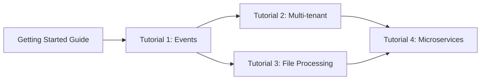

# OAP Advanced Tutorials

This directory contains comprehensive, production-ready tutorials that demonstrate advanced OAP framework capabilities. Each tutorial is a complete, working application with step-by-step instructions, code examples, and best practices.

## Prerequisites

Before starting these tutorials, you should:
- Complete the [Getting Started Guide](../getting-started.md)
- Understand the [Core Concepts](../developer-guide.md#core-concepts)
- Have Java 17+ and Maven 3.6+ installed
- Be familiar with basic OAP concepts (modules, services, configuration)

## Tutorial Overview

### 1. Real-time Event Processing Pipeline

**Difficulty:** ⭐⭐⭐ Intermediate
**Time:** 2-3 hours
**File:** [01-event-processing-pipeline.md](01-event-processing-pipeline.md)

Build a production-ready log analytics system with:
- Binary messaging queues for event ingestion
- MongoDB for high-volume event storage
- Real-time statistics aggregation with StatsDB
- Scheduled rollup tasks for data optimization
- Slack alerting on anomaly detection
- REST APIs for querying statistics

**Technologies used:**
- `oap-message` - Binary messaging
- `oap-storage-mongo` - Event persistence
- `oap-statsdb` - Real-time aggregation
- `oap-alert-slack` - Alerting
- Background workers - Event processing

**What you'll learn:**
- Event-driven architecture
- Message queue patterns
- Real-time data aggregation
- Scheduled task management
- Alert threshold configuration
- Production monitoring

**Use case:** Log analytics, metrics collection, event streaming

---

### 2. Multi-tenant SaaS Application

**Difficulty:** ⭐⭐⭐⭐ Advanced
**Time:** 3-4 hours
**File:** [02-multi-tenant-saas.md](02-multi-tenant-saas.md)

Build a multi-tenant project management SaaS with:
- Session-based authentication with cookies
- Tenant isolation (data segregation by organization)
- Role-based access control (RBAC)
- Tenant-specific MongoDB collections
- Custom interceptors for auth and tenant context
- Health checks and Prometheus metrics
- Production-ready patterns

**Technologies used:**
- `oap-ws-sso` - Session management
- `oap-storage-mongo` - Multi-tenant storage
- Interceptors - Auth and tenant isolation
- `oap-http-prometheus` - Metrics

**What you'll learn:**
- Multi-tenancy architecture
- Session authentication
- Role-based access control
- Data isolation strategies
- Custom interceptors
- Production monitoring
- Audit logging

**Use case:** SaaS platforms, B2B applications, multi-client systems

---

### 3. Async File Processing Service

**Difficulty:** ⭐⭐⭐ Intermediate
**Time:** 2-3 hours
**File:** [03-async-file-processing.md](03-async-file-processing.md)

Build a file processing service with:
- HTTP file upload with multipart form data
- Asynchronous job processing with queues
- CSV/TSV parsing and validation
- HTML report generation from templates
- Email notifications on completion
- Real-time progress tracking
- Job status API

**Technologies used:**
- `oap-ws` - File upload API
- `oap-tsv` - CSV parsing
- `oap-template` - Report generation
- `oap-mail` - Email notifications
- `oap-storage` - Job queue
- CompletableFuture - Async endpoints

**What you'll learn:**
- File upload handling
- Background job processing
- Data validation patterns
- Template-based reporting
- Email integration
- Progress tracking
- Async API design

**Use case:** Data import, batch processing, ETL pipelines

---

### 4. Distributed Microservices

**Difficulty:** ⭐⭐⭐⭐⭐ Expert
**Time:** 4-5 hours
**File:** [04-distributed-microservices.md](04-distributed-microservices.md)

Build a distributed e-commerce system with:
- Multiple microservices (Product, Inventory, Payment, Order)
- RPC communication between services using oap-remote
- API Gateway for client requests
- Distributed transactions with Saga pattern
- Service orchestration and compensation logic
- Cross-service health monitoring
- Fault tolerance patterns

**Technologies used:**
- `oap-remote` - RPC between services
- `oap-ws` - HTTP APIs
- `oap-storage` - Service data
- Multiple service instances

**What you'll learn:**
- Microservices architecture
- RPC communication
- Distributed transactions
- Saga pattern
- Service orchestration
- Compensation logic
- Circuit breakers
- Service discovery

**Use case:** E-commerce, distributed systems, microservices platforms

---

## Learning Path

We recommend following the tutorials in order:



**Suggested progression:**
1. Start with **Tutorial 1** to learn background processing and messaging
2. Move to **Tutorial 2** for authentication and tenant isolation
3. Complete **Tutorial 3** for async processing and job queues
4. Finish with **Tutorial 4** to master distributed systems

## Quick Comparison

| Tutorial | Complexity | Time | Key Modules | Best For |
|----------|------------|------|-------------|----------|
| 1. Event Processing | Medium | 2-3h | message, statsdb, mongo | Data pipelines |
| 2. Multi-tenant SaaS | High | 3-4h | ws-sso, interceptors | SaaS apps |
| 3. File Processing | Medium | 2-3h | tsv, template, mail | Batch jobs |
| 4. Microservices | Expert | 4-5h | remote, distributed | Complex systems |

## What's Included in Each Tutorial

Every tutorial provides:

✅ **Complete working code** - Copy-paste ready examples
✅ **Step-by-step instructions** - Clear progression from start to finish
✅ **Architecture diagrams** - Visual representation of components
✅ **Configuration files** - All HOCON configs included
✅ **Test scripts** - curl commands and test data
✅ **Production considerations** - Scaling, security, monitoring
✅ **What you'll learn** - Clear learning objectives
✅ **Troubleshooting** - Common issues and solutions
✅ **Next steps** - How to extend the application

## Running the Tutorials

Each tutorial is self-contained with its own:
- Maven project setup
- Domain models
- Service implementations
- Configuration files
- Test data and scripts

**General steps:**
1. Create a new directory for the tutorial
2. Follow the step-by-step instructions
3. Build with `mvn clean package`
4. Run the application
5. Test with provided curl commands
6. Experiment with modifications

## Code Organization

Tutorial code follows this structure:

```
tutorial-project/
├── pom.xml
├── application.conf
├── src/
│   ├── main/
│   │   ├── java/
│   │   │   └── com/example/
│   │   │       ├── model/      # Domain models
│   │   │       ├── service/    # Business logic
│   │   │       ├── api/        # REST endpoints
│   │   │       └── Main.java   # Application entry point
│   │   └── resources/
│   │       ├── META-INF/
│   │       │   └── oap-module.conf
│   │       └── templates/      # If using templates
│   └── test/
│       └── java/               # Test cases
└── data/                       # Runtime data (created automatically)
```

## Additional Resources

After completing the tutorials, explore:

- **[Developer Guide](../developer-guide.md)** - Deep dive into OAP concepts
- **[Module Documentation](../../README.md#module-reference)** - Detailed API docs
- **[Configuration Reference](../configuration-reference.md)** - All config options
- **[Getting Started](../getting-started.md)** - Basic introduction

## Common Patterns Covered

Across all tutorials, you'll learn:

### Architecture Patterns
- Event-driven architecture (Tutorial 1)
- Multi-tenancy (Tutorial 2)
- Job queue pattern (Tutorial 3)
- Microservices & API Gateway (Tutorial 4)

### Data Patterns
- Real-time aggregation (Tutorial 1)
- Data isolation (Tutorial 2)
- Data validation (Tutorial 3)
- Distributed transactions (Tutorial 4)

### Integration Patterns
- Message queues (Tutorial 1)
- Session management (Tutorial 2)
- Email notifications (Tutorial 3)
- RPC communication (Tutorial 4)

### Production Patterns
- Health checks (All tutorials)
- Monitoring & metrics (1, 2)
- Error handling (All tutorials)
- Fault tolerance (4)

## Getting Help

If you encounter issues:

1. **Check the logs** - OAP provides detailed logging
2. **Review configuration** - Verify HOCON syntax and service references
3. **Read error messages** - OAP errors are descriptive
4. **Check module READMEs** - Each module has detailed docs
5. **Ask questions** - Open an issue on GitHub

## Contributing

Found an issue or want to improve a tutorial?

- Report bugs in the tutorials
- Suggest improvements
- Submit corrections
- Add more examples

## Next Level

After mastering these tutorials, consider:

- Building your own OAP modules
- Contributing to the OAP framework
- Creating custom interceptors
- Implementing custom storage backends
- Building OAP-based products

---

**Ready to start?** Begin with [Tutorial 1: Real-time Event Processing Pipeline](01-event-processing-pipeline.md)!
